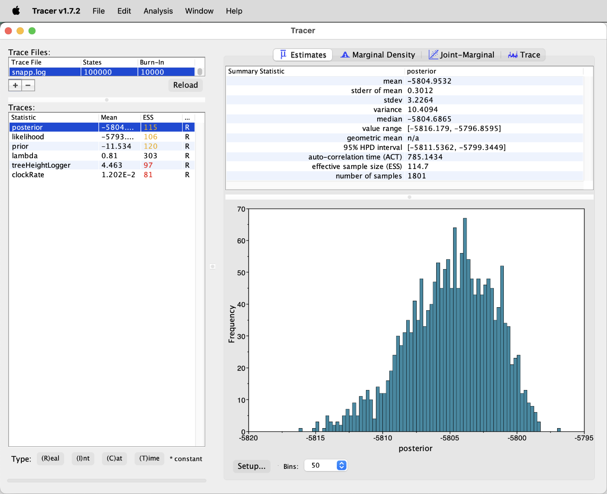
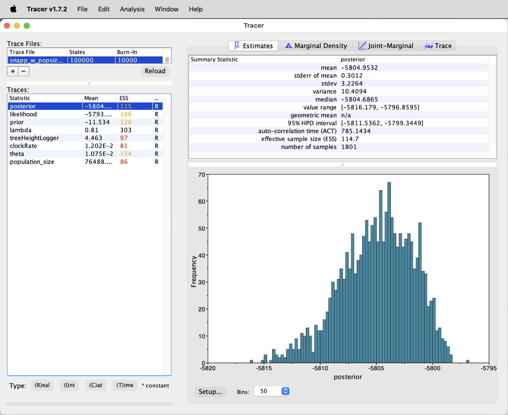
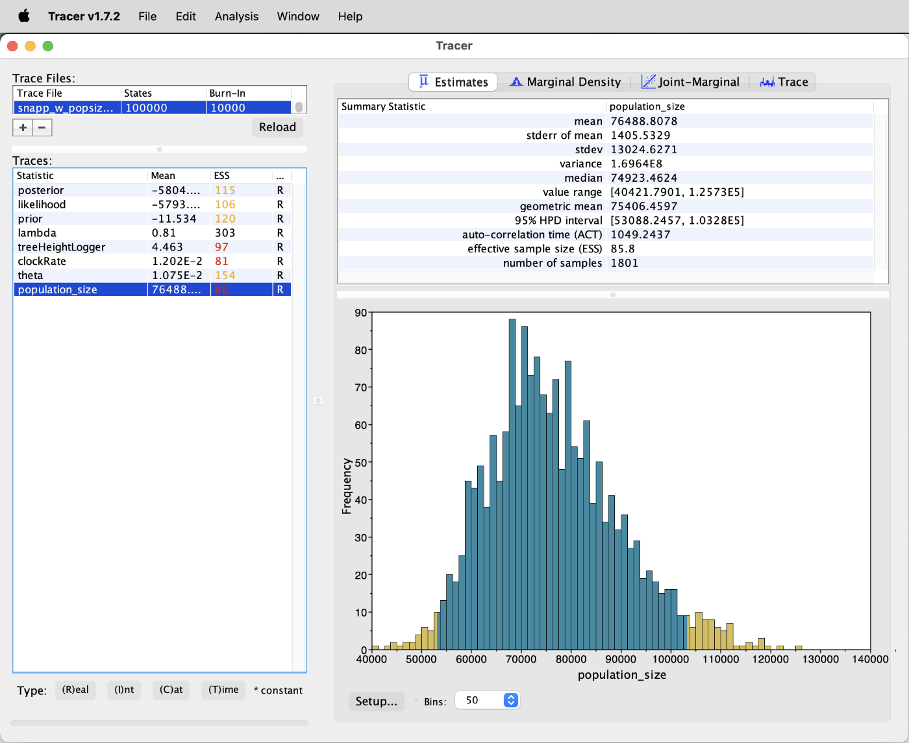
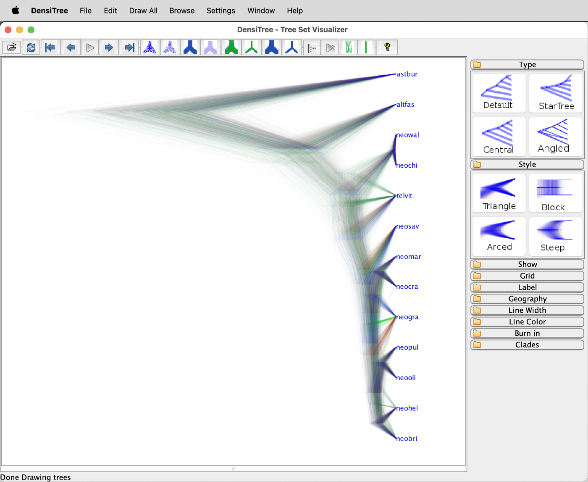
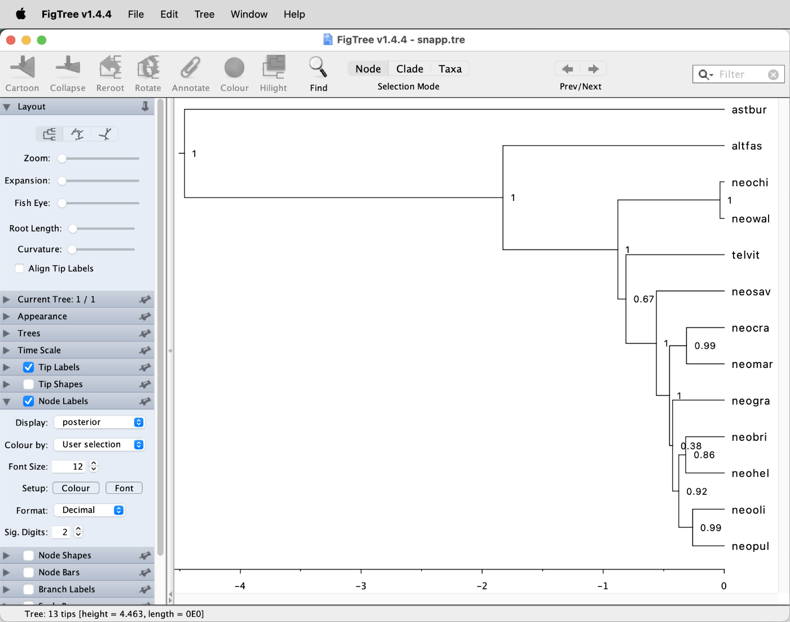
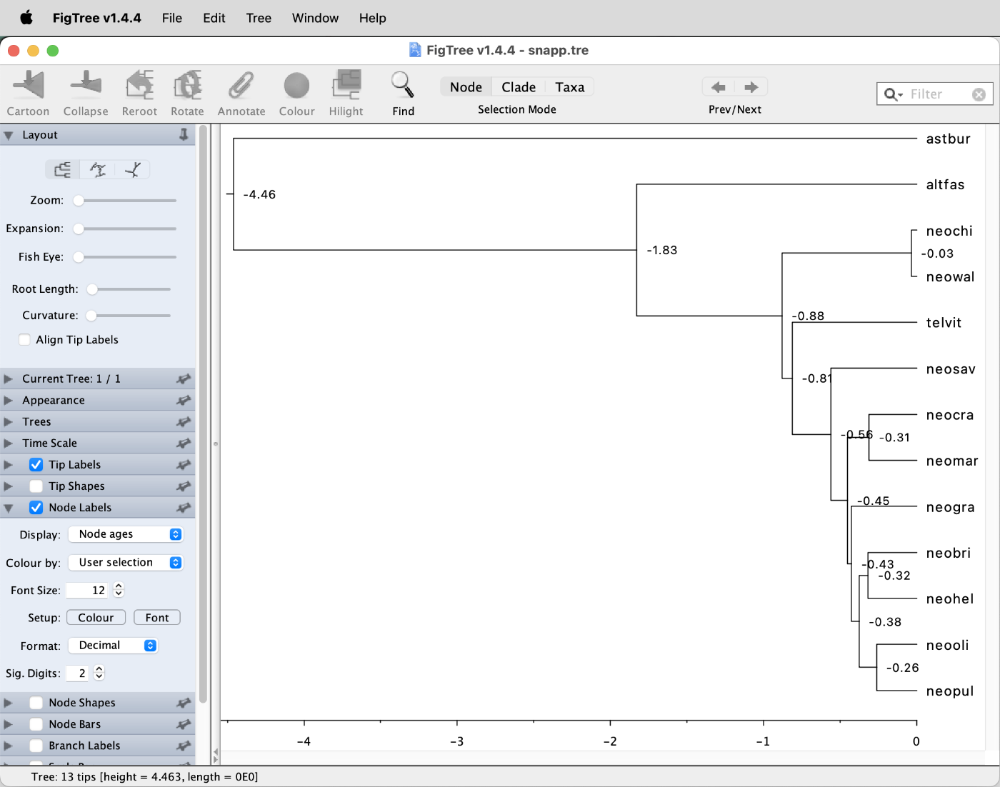

# Divergence-Time Estimation with SNP Data

A tutorial on Bayesian divergence-time estimation with SNP data

## Summary

Besides [SVDQuartets](https://www.asc.ohio-state.edu/kubatko.2/software/SVDquartets/) ([Chifman and Kubatko 2014](https://doi.org/10.1093/bioinformatics/btu530)), another methods for phylogenetic inference with the multi-species-coalescent model based on SNP data is implemented in [SNAPP (SNP and AFLP Package for Phylogenetic analysis)](https://www.beast2.org/snapp/) ([Bryant et al. 2012](https://doi.org/10.1093/molbev/mss086)), an add-on packages for the program BEAST2. SNAPP is in principle similar to the approach of StarBeast3, only that each single SNP is considered as its own marker and gene trees are not separately inferred for each of these markers. Instead, SNAPP calculates the probability of the species tree without inferring gene trees, by mathematically integrating over all possible gene trees. This approach reduces the parameter space of the model tremendously and might thus be expected to also reduce the computational demand of the analysis. Unfortunately, however, the mathematical integration over all possible gene trees is computationally very demanding and SNAPP analyses are therefore only feasible for a relatively small number of individuals per species.

Another limitation of SNAPP has long been that the reported branch lengths were in coalescent units rather than in units of time, and that these could not easily be converted into time due to ascertainment bias in the SNP data. To address this, we tweaked the settings of SNAPP in our study [Stange et al. (2018)](https://doi.org/10.1093/sysbio/syy006) so that they include a strict-clock model that can be time calibrated based on the fossil record or on information from other phylogenies.

## Table of contents

* [Outline](#outline)
* [Dataset](#dataset)
* [Requirements](#requirements)
* [Divergence-time estimation with SNAPP](#snapp)
* [Interpretation of SNAPP results](#interpretation)

## Outline

In this tutorial I am going to present how the BEAST2 add-on package SNAPP can be used for divergence-time estimation with SNP data. The settings for time-calibrated inference with both approaches can not be specified through the program BEAUti, but instead the Ruby script [`snapp_prep.rb`](https://github.com/mmatschiner/snapp_prep) can be used to generate input files for time-calibrated analyses with SNAPP. Differences between the inferred species tree and the species tree generated in tutorial [Bayesian Species-Tree Inference](../bayesian_species_tree_inference/README.md) will be explored.

## Dataset

The SNP data used in this tutorial are the filtered dataset used for species-tree inference with SVDQuartets in tutorial [Species-Tree Inference with SNP Data](../species_tree_inference_with_snp_data/README.md). You can find more information about the origin of this dataset in the Dataset section of this other tutorial. In brief, the dataset has been filtered to include only bi-allelic SNPs with a low proportion of missing data, for the 26 individuals from 13 cichlid species listed in the table below. Only SNPs mapping to chromosome 5 of the Nile tilapia genome assembly ([Conte et al. 2017](https://doi.org/10.1186/s12864-017-3723-5)) are included in the dataset, and these have been thinned so that no pair of SNPs is closer to each other than 100 bp.

| Individual ID | Species ID | Species name                  | Tribe         |
|---------------|------------|-------------------------------|---------------|
| IZA1          | astbur     | *Astatotilapia burtoni*       | Haplochromini |
| IZC5          | astbur     | *Astatotilapia burtoni*       | Haplochromini |
| AUE7          | altfas     | *Altolamprologus fasciatus*   | Lamprologini  |
| AXD5          | altfas     | *Altolamprologus fasciatus*   | Lamprologini  |
| JBD5          | telvit     | *Telmatochromis vittatus*     | Lamprologini  |
| JBD6          | telvit     | *Telmatochromis vittatus*     | Lamprologini  |
| JUH9          | neobri     | *Neolamprologus brichardi*    | Lamprologini  |
| JUI1          | neobri     | *Neolamprologus brichardi*    | Lamprologini  |
| KHA7          | neochi     | *Neolamprologus chitamwebwai* | Lamprologini  |
| KHA9          | neochi     | *Neolamprologus chitamwebwai* | Lamprologini  |
| IVE8          | neocra     | *Neolamprologus crassus*      | Lamprologini  |
| IVF1          | neocra     | *Neolamprologus crassus*      | Lamprologini  |
| JWH1          | neogra     | *Neolamprologus gracilis*     | Lamprologini  |
| JWH2          | neogra     | *Neolamprologus gracilis*     | Lamprologini  |
| JWG8          | neohel     | *Neolamprologus helianthus*   | Lamprologini  |
| JWG9          | neohel     | *Neolamprologus helianthus*   | Lamprologini  |
| JWH3          | neomar     | *Neolamprologus marunguensis* | Lamprologini  |
| JWH4          | neomar     | *Neolamprologus marunguensis* | Lamprologini  |
| JWH5          | neooli     | *Neolamprologus olivaceous*   | Lamprologini  |
| JWH6          | neooli     | *Neolamprologus olivaceous*   | Lamprologini  |
| ISA6          | neopul     | *Neolamprologus pulcher*      | Lamprologini  |
| ISB3          | neopul     | *Neolamprologus pulcher*      | Lamprologini  |
| ISA8          | neosav     | *Neolamprologus savoryi*      | Lamprologini  |
| IYA4          | neosav     | *Neolamprologus savoryi*      | Lamprologini  |
| KFD2          | neowal     | *Neolamprologus walteri*      | Lamprologini  |
| KFD4          | neowal     | *Neolamprologus walteri*      | Lamprologini  |

## Requirements

* **BEAST2:** BEAST2 is a program for Bayesian phylogenetic analyses, that comes bundled with other tools, such as BEAUti (used to prepare BEAST2 input) and TreeAnnotator (used to process BEAST2 output). The BEAST2 program package needs to be installed on your local computer (see [Requirements](../requirements/README.md)).

* **Tracer:** The program [Tracer](http://beast.community/tracer) facilitates the inspection of output from Bayesian analyses such as those done with BEAST2. Tracer needs to be installed on your local computer (see [Requirements](../requirements/README.md)).

* **FigTree:** The program [FigTree](http://tree.bio.ed.ac.uk/software/figtree/) is an intuitive and useful tool for the visualization and (to a limited extent) manipulation of phylogenies encoded in [Newick](http://evolution.genetics.washington.edu/phylip/newicktree.html) format. FigTree needs to be installed on your local computer (see [Requirements](../requirements/README.md)).

* **SNAPP:** The [SNAPP method](https://www.beast2.org/snapp/) ([Bryant et al. 2012](https://doi.org/10.1093/molbev/mss086)) add-on package for BEAST2 implements a version of the multi-species coalescent model that mathematically integrates over all possible trees at biallelic loci, and is therefore particularly well suited for SNP data. SNAPP can be installed through the BEAST2 Package Manager; however, since BEAUti will not be used to prepare SNAPP input files, the SNAPP package does not need to be installed on local computers, but only on lynx, as described in the tutorial.

## Divergence-time estimation with SNAPP

In this part of the tutorial, we are going to run a SNAPP analysis using an XML input file that is prepared with the Ruby script `snapp_prep.rb` ([Stange et al. (2018)](https://doi.org/10.1093/sysbio/syy006)). The settings specified by this script allow time calibration of the species tree estimated by SNAPP through age constraints on one or more divergence events. Additionally, the population sizes of all species are linked to avoid unfeasible run times when more than a handful of species are analyzed.

Based on simulations, we tested the performance of SNAPP with a range of datasets in [Stange et al. (2018)](https://doi.org/10.1093/sysbio/syy006). We found that the run time of SNAPP increases more or less linearly with the number of SNPs included in the dataset, but that the number of individuals used per species has an even stronger influence on run time. However, we also found that accurate and strongly supported species trees can be obtained with datasets containing only around 1,000 SNPs for just a single individual per species. Thus, before preparing the input file for SNAPP, we will first reduce the dataset that was already filtered in tutorial [Species-Tree Inference with SNP Data](../species_tree_inference_with_snp_data/README.md). This further filtering will again be done with BCFtools.

* If you no longer have file `NC_031969.f5.sub4.vcf` (it was produced in tutorial [Species-Tree Inference with SNP Data](../species_tree_inference_with_snp_data/README.md)), download it from GitHub:
	
		wget https://github.com/mmatschiner/phylogenomics/raw/refs/heads/main/divergence_time_estimation_with_snp_data/data/NC_031969.f5.sub4.vcf

As mentioned above and in tutorial [Species-Tree Inference with SNP Data](../species_tree_inference_with_snp_data/README.md), the dataset in file `NC_031969.f5.sub4.vcf` contains SNP data for two individuals per species. To reduce the run time for SNAPP, we are going to produce another version of the same dataset that is reduced to only a single individual per species.

* To exclude the individuals "IZA1", "AXD5", "JBD5", "JUI1", "KHA9", "IVF1", "JWH1", "JWG8", "JWH3", "JWH5", "ISA6", "IYA4", and "KFD4" (these were selected because they have more missing data than the other individuals of each species) from a new file named `NC_031969.f5.sub5.vcf`, use the following commands:

		bcftools view -s ^IZA1,AXD5,JBD5,JUI1,KHA9,IVF1,JWH1,JWG8,JWH3,JWH5,ISA6,IYA4,KFD4 -o NC_031969.f5.sub5.vcf NC_031969.f5.sub4.vcf
		
	The reduction of individuals might have led to some sites becoming monomorphic for either the reference or the alternate allele. Some sites might also have no data left for one or more of the species, given that these are now represented by only one instead of two individuals. These could now be excluded these sites again with BCFtools, for example with the `bcftools view` option `-e 'AC==0 || AC==AN || F_MISSING > 0.0'`. However, this is not necessary because the `snapp_prep.rb` script, which will be used to write the XML file for SNAPP, will automatically exclude these sites anyway.
	
	 **Question 1:** How many SNPs are left in file `NC_031969.f5.sub5.vcf`? [(see answer)](#q1)

* Download the script `snapp_prep.rb` from GitHub:

		wget https://raw.githubusercontent.com/mmatschiner/snapp_prep/master/snapp_prep.rb
		
* To see the options available for generating SNAPP input files with `snapp_prep.rb`, have a look at the help text of the script by using the following commands:

		ruby snapp_prep.rb -h
		
	You'll see that `snapp_prep.rb` can write XML files for either SNAPP or [SNAPPER](https://github.com/rbouckaert/snapper) ([Stoltz et al. 2021](https://doi.org/10.1093/sysbio/syaa051)) (option `-a`), and that it accepts input either in Phylip (with option `-p`) or VCF (option `-v`) format. In addition, the script requires a table file (option `-t`) in which individuals are assigned to species, and a constraint file (option `-c`) in which age constraints for selected divergence events are specified. None of the other options are required, but these can be useful if you need to specify a starting tree (option `-s`) because SNAPP fails to find a suitable starting tree itself, if you want to increase or decrease the default length (500,000 iterations) of the MCMC chain (option `-l`), or if you want to limit the dataset to a certain number of SNPs to reduce the run time (option `-m`). 
	
* Examples for the table and constraint files can be found on the [GitHub repository for `snapp_prep.rb`](https://github.com/mmatschiner/snapp_prep). Have a look at these example files; the example table file is named [`example.spc.txt`](https://github.com/mmatschiner/snapp_prep/blob/master/example.spc.txt) and the example constraint file is named [`example.con.txt`](https://github.com/mmatschiner/snapp_prep/blob/master/example.con.txt).

* To prepare the table file assigning individuals to species, open a new file named `individuals.txt` with a text editor available on Saga, and write the following text to this new file:

		species	individual
		astbur	IZC5
		altfas	AUE7
		telvit	JBD6
		neobri	JUH9
		neochi	KHA7
		neocra	IVE8
		neogra	JWH2
		neohel	JWG9
		neomar	JWH4
		neooli	JWH6
		neopul	ISB3
		neosav	ISA8
		neowal	KFD2

* For the constraint file, we'll need to specify at least one age constraint for a divergence among the 13 cichlid species. For this, we can refer to the results of the analysis with the multi-species coalescent model in tutorial [Bayesian Species-Tree Inference](../bayesian_species_tree_inference/README.md). In that tutorial, the divergence of *Astatotilapia burtoni* ("astbur") and the *Neolamprologus* species was estimated at 4.6 Ma with a 95% HPD interval from 3.3 to 6.2 Ma. We can approximate this mean and confidence interval with a lognormal distribution centered at 4.6 Ma that has a standard deviation (in real space) of 0.16. In addition, we could also constrain the first divergence among the species *Neolamprologus brichardi* ("neobri"), *Neolamprologus gracilis* ("neogra"), *Neolamprologus marunguensis* ("neomar"), and *Neolamprologus olivaceus* ("neooli") according to the results of this earlier analysis; however, it is likely that this divergence event would be more precisely estimated with the current SNP dataset. Thus, we are only going to constrain the age of a single node: the divergence of *Astatotilapia burtoni* ("astbur") from the species of the tribe Lamprologini.

	To write this single age constraint to a constraint file, write the following text to a new file named `constraints.txt`:

		lognormal(0,4.6,0.16)	crown	astbur,altfas,telvit,neobri,neochi,neocra,neogra,neohel,neomar,neooli,neopul,neosav,neowal
		
	Note that the above line contains three character strings that are delimited with white space (tabs or spaces). The first of the three character strings specifies that a lognormal distribution with an offset of 0, a mean of 4.6, and a standard deviation (in real space) of 0.16 should be used for the constraint. The second character string ("crown") specifies that the crown divergence of the clade should be constrained rather than the stem divergence (this would be the time at which the clade diverged from its sister group). Finally, the third character string simply lists all species included in the constrained clade, separated by commas. Because the constraint used here applies to the very first divergence of the phylogeny (the root), all species names are listed in the third character string.

	**Question 2:** Can you think of a way how the exact same age calibration could be specified differently? [(see answer)](#q2)

* With the VCF file `NC_031969.f5.sub5.vcf`, the table file, and the constraints file ready, we can now prepare the input file for SNAPP with the script `snapp_prep.rb`. To limit the dataset to 1,000 randomly selected SNPs and to set a chain length of 100,000 MCMC iterations, we'll use the options `-m 1000` and `-l 100000`, respectively. To specify that the XML file should be for SNAPP rather than SNAPPER, option `-a` does not need to be specified because the SNAPP format is produced by default. Thus, use the following command to generate the XML input file for SNAPP:

		ruby snapp_prep.rb -v NC_031969.f5.sub5.vcf -t individuals.txt -c constraints.txt -m 1000 -l 100000

	**Question 3:** How many sites useful for SNAPP did the dataset contain after we reduced it to a single individual per species? [(see answer)](#q3)
		
	You may notice that the chain length of 100,000 MCMC iterations is extremely short compared to those used in the BEAST2 analyses of other tutorials. Using much shorter chain lengths with SNAPP than BEAST2 is quite common, given that the SNAPP model has far fewer model parameters than most models used in other BEAST2 analyses, and that each individual iteration is much slower with SNAPP due to the high computational demand of the integration over all possible gene trees at each SNP.
		
* The script `snapp_prep.rb` should have written a file named `snapp.xml`. You could open that, for example with `less -S snapp.xml` and read some of the annotations if you'ld like to know more about the settings that we are about to use with SNAPP.
		
To "run SNAPP", we actually run BEAST2. The analysis can be sped up by using multiple CPUs, as SNAPP analyses are highly parallelizable. Thus, with e.g. four CPUs available that are all used for the SNAPP analysis, this analysis should take only about a fourth of the time that would be required with a single CPU. When running SNAPP analyses on a server such as lynx, one could even use tens of CPUs simultaneously, which would shorten SNAPP's run times tremendously. We will here use 16 CPUs on lynx to speed up the analysis.

* Write a Slurm script named `run_snapp.slurm` with the following content to prepare the SNAPP analysis:

		#!/bin/bash

		# Job name:
		#SBATCH --job-name=snapp
		#
		# Wall clock limit:
		#SBATCH --time=2:00:00
		#
		# Processor and memory usage:
		#SBATCH --ntasks=1
		#SBATCH --cpus-per-task=16
		#SBATCH --mem-per-cpu=1G
		#
		# Output:
		#SBATCH --output=run_snapp.out
		
		# Run snapp.
		beast2 -threads 16 snapp.xml

* Make sure that the SNAPP add-on package is installed on lynx:

		packagemanager -add SNAPP

* Submit the Slurm script with `sbatch`:

		sbatch run_snapp.slurm

* Monitor the file `run_snapp.out` by repeatedly opening it over the course of a few minutes (using, e.g. `less run_snapp.out` or `tail run_snapp.out`). Alternatively, use the program `watch` to monitor the output:

		watch tail run_snapp.out
		
	(use Ctrl-C to return to the command line)

	**Question 4:** How long is SNAPP going to run to reach the MCMC length of 100,000 iterations that we specified when setting up the XML with `snapp_prep.rb`? [(see answer)](#q4)

## Interpretation of SNAPP results

* Once the SNAPP analysis has completed, download the file `snapp.log` to your local computer with `scp` and open it in Tracer. The Tracer window should then display run statistics similar to those shown in the next screenshot.

You'll see that some low ESS values indicate that the MCMC chain has not yet reached stationarity and that the analysis should ideally have been performed with more MCMC iterations. For our interpretation here, however, we'll assume that the degree of stationarity is sufficient. What you also should notice is that the list of parameters on the left-hand side of the window is now much shorter than it usually is with results of BEAST2 analyses. In fact, only three parameters are shown: The speciation rate ("lambda"), the age of the root of the species tree ("treeHeightLogger"), and the substitution rate ("clockRate"). Note that the substitution rate is not comparable to a genome-wide rate due to ascertainment bias in the SNP dataset, even though SNAPP by default applies an ascertainment-bias correction (see [Bryant et al. 2012](https://doi.org/10.1093/molbev/mss086) for details). However, one model parameter is not included in the log output yet, namely the population size. Recall that by using script `snapp_prep.rb` to generate the XML file, we implemented a model in which the population sizes of all branches are set to be identical to each other. Thus, if the population sizes had been included in the log file, this file would contain a large number of columns with identical information. To avoid this, the output of the population sizes to the log file has been disabled by `snapp_prep.rb`. However, the population size estimates are still available because they were instead written to the tree file `snapp.trees`, and we can now add them to the log file `snapp.log` using the Ruby script `add_theta_to_log.rb`. Thus, download the script `add_theta_to_log.rb` from the GitHub repository for `snapp_prep.rb` to your tutorial directory on lynx:

		wget https://raw.githubusercontent.com/mmatschiner/snapp_prep/master/add_theta_to_log.rb
		
* Have a look at the available options for `add_theta_to_log.rb`:

		ruby add_theta_to_log.rb -h
		
	You'll see that this script requires four command-line arguments: The names of the log and tree input files, the name of an output file, as well as an estimate for the generation time. The latter is required to calculate an estimate of the effective population size, for which `add_theta_to_log.rb` uses the equation <i>N</i>e = Theta &div; (4 &times; <i>r</i> &div; <i>n</i>g), where <i>r</i> is the substitution-rate estimate (= the rate of the strict clock) and <i>n</i>g is the number of generations per time unit (more details are given in [Stange et al. 2018](https://doi.org/10.1093/sysbio/syy006)).
	
* We'll here assume (as in other tutorials) that the generation time of cichlids is three years, and we'll name the output file `snapp_w_popsize.log`. Thus use the following command to run script `add_theta_to_log.rb`:

		 ruby add_theta_to_log.rb -l snapp.log -t snapp.trees -g 3 -o snapp_w_popsize.log

* Then, download file `snapp_w_popsize.log` to your local computer and open it also in Tracer. You should see that "theta" and "population_size" have now been added to the list of parameters, as shown in the next screenshot.

* Select both "clockRate" and "theta" from the list of parameters, click the tab for "Joint-Marginal" at the top right, and remove the tick at the bottom of the panel next to "Sample only". You should then see that both of these parameters are highly correlated, as shown in the next screenshot.

Note that both of these estimates should not be taken as being representative for the whole genome due to ascertainment bias. Because invariant sites are not included in a SNP dataset, this SNP dataset necessarily appears more variable than the whole-genome dataset from which it was derived, and thus the substitution rate of the SNP data appears to be higher than the rate would be if it was averaged over the entire genome. Nevertheless, our simulations in [Stange et al. (2018)](https://doi.org/10.1093/sysbio/syy006) have shown that the population-size estimates of SNAPP are actually reliable.

* Select "population_size" from the list of parameters and click on the "Estimates" tab to see summary information and a histogram for the population-size estimate, as shown in the next screenshot.

	
	**Question 5:** How does this estimate of the population size of Lake Tanganyika cichlid fishes compare to that assumed in tutorial [Bayesian Species-Tree Inference](../bayesian_species_tree_inference/README.md)? [(see answer)](#q5)

* Next, download the file `snapp.trees` from lynx to your local computer and open it in the software Densitree from the BEAST2 package (it can be found in the same directory as the GUI versions of BEAST2 and BEAUti) to visualize the full set of posterior trees sampled by SNAPP, as shown in the next screenshot.

You should see that not all posterior trees share the same topology, indicating remaining uncertainty in the relationships of the 13 cichlid species. In particular, the relationships of *Telmatochromis vittatus* ("telvit"; the fifth species from the top) appear ambiguous, as this species is placed next to *Neolamprologus walteri* ("neowal") and *Neolamprologus chitamwebwai* ("neochi") in some of the posterior trees, but apparently closer to the remaining *Neolamprologus* species or ancestral to all of them in the other posterior trees. The relationships among the five species *Neolamprologus brichardi* ("neobri"), *Neolamprologus olivaceous* ("neooli"), *Neolamprologus pulcher* ("neopul"), *Neolamprologus helianthus* ("neohel"), and *Neolamprologus gracilis* ("neogra") also appear uncertain.

* Also quantify the posterior probabilities of clades as node support in a maximum-clade-credibility tree using TreeAnnotator on lynx. Set the burnin percentage to 10, choose mean heights as node heights, select `snapp.trees` as the input file, and name the output file "snapp.tre":

		treeannotator -burnin 10 -height mean snapp.trees snapp.tre

* Download file `snapp.tre` from lynx to your local computer with `scp` and open it in FigTree.

* Display the "posterior" node support values as node labels, as shown in the screenshot below.

The posterior probabilities for the different clades support the interpretation based on the Densitree plot made above: The position of *Telmatochromis vittatus* ("telvit") is uncertain, and so are the relationships within the clade comprising comprising *Neolamprologus olivaceous* ("neooli"), *N. pulcher* ("neopul"), *N. gracilis* ("neogra"), *N. brichardi* ("neobri"), and *N. helianthus* ("neohel").
	
	**Question 6:** Is the species-tree topology estimated with SNAPP concordant with that estimated with SVDQuartets in tutorial [Species-Tree Inference with SNP Data](../species_tree_inference_with_snp_data/README.md)? [(see answer)](#q6)
	
	**Question 7:** How does the divergence-time estimate for *Neolamprologus marunguensis* ("neomar"), *Neolamprologus gracilis* ("neogra"), *Neolamprologus brichardi* ("neobri"), and *Neolamprologus olivaceous* ("neooli") compare to that obtained with StarBeast3 in tutorial [Bayesian Species-Tree Inference](../bayesian_species_tree_inference/README.md)? [(see answer)](#q7)

Despite the remaining uncertainty in the relationships among the *Neolamprologus* species, the SNAPP analysis has been valuable as it allowed us to estimate an average population size for species of the tribe Lamprologini, and improved the estimates of divergence times within the group.

 

                   

## Answers

* **Question 1:** 65,325 SNPs should still remain in the filtered dataset in file `NC_031969.f5.sub5.vcf`, which is more than sufficient for a phylogenetic analysis with SNAPP. To see the number of SNPs in this VCF file, you can use the the following command:

		bcftools view -H NC_031969.f5.sub5.vcf | wc -l
		
		

* **Question 2:** Because the crown divergence of a clade is identical to the stem divergences of the two descending clades, we could also specify the same age constraint with the following line:

		lognormal(0,4.6,0.16)  stem altfas,telvit,neobri,neochi,neocra,neogra,neohel,neomar,neooli,neopul,neosav,neowal
		
	Note that "stem" is now specified as the second character string instead of "crown" and that "astbur" is now missing from the list of species in the third character string.

* **Question 3:** The screen output produced by `snapp_prep.rb` should report that 78 sites were half missing, 40,199 sites had only missing data for one or more species, and 6,931 sites were monomorphic out of the total of 65,325 sites. Thus, 65,325 - 78 - 40,199 - 6,931 = 18,117 sites could have been used by SNAPP. Out of these, the script sampled 1,000 sites because we had specified a maximum number of 1,000 sites with option `-m`.

* **Question 4:** You should be able to estimate the time required for the analysis by comparing the first column of the output in file `run_snapp.out`, which reports the current MCMC iteration, with the time that the analysis has already been running. After a minute, the MCMC should have reached around iteration 3,000, which means that about half an hour will be required to complete the 100,000 iterations that we specified as the length of the MCMC. After about 6,000 iterations, the last column of the output in file `run_snapp.out` should also give an estimate of the run time required for 1 million iterations. Dividing this by ten should also result in a projected run time of around half an hour.

* **Question 5:** Recall that in tutorial [Bayesian Species-Tree Inference](../bayesian_species_tree_inference/README.md), the population-size parameter was fixed in the analysis with the multi-species coalescent model according to an estimate published by [Meyer et al. (2017)](https://doi.org/10.1093/sysbio/syw069). In this study, Meyer et al. (2017) reported that "effective population sizes (<i>N</i>e) estimated with the multispecies coalescent model ranged between 3.6 &times; 104 and 8.1 &times; 105, assuming a mean generation times of 3 years for cichlid fishes". Most of these population-size estimates in Meyer et al. (2017) were around 3.3 &times; 105, therefore this value was used in tutorial [Bayesian Species-Tree Inference](../bayesian_species_tree_inference/README.md). In comparison to this population size assumed in the other tutorial, the current population-size estimate based on the SNAPP analysis, with a mean of 7.8 &times; 104 and a 95% HPD interval ranging from 5.3 &times; 104 to 1.1 &times; 105, is much smaller.

* **Question 6:** No, the topologies of the trees produced with SVDQuartets and SNAPP are not concordant. For example, SVDQuartets recovered a clade comprising *Neolamprologus brichardi* ("neobri"), *N. olivaceus* ("neooli"), and *N. pulcher* ("neopul"), even though *Neolamprologus brichardi* ("neobri") was found to cluster with *N. helianthus* ("neohel") in the SNAPP analysis. Note, however, that all conflicting nodes have low support in at least one of the two trees.

* **Question 7:** Recall that the divergence time of the four species *Neolamprologus marunguensis* ("neomar"), *Neolamprologus gracilis* ("neogra"), *Neolamprologus brichardi* ("neobri"), and *Neolamprologus olivaceous* ("neooli") was estimated around 0.84 Ma in the analysis with StarBeast3 in tutorial [Bayesian Species-Tree Inference](../bayesian_species_tree_inference/README.md). In contrast, the first divergence of the clade comprising these four species was estimated with SNAPP at a more recent time, around 0.43 Ma, as shown in the screenshot below. The 95% HPD interval for this age estimate ranges from 0.29 to 0.58 Ma (select "height\_95%\_HPD" instead of "Node ages" from the drop-down menu to see these). In contrast, the 95% HPD interval for this divergence time in the StarBeast3 analysis was wider and ranged from 0.41 to 1.28 Ma, which thus includes a large part of the 95% HPD interval of the SNAPP analysis (including the mean estimate). This indicates that the two analyses do not disagree with each other regarding this divergence time but that the StarBeast3 analysis was not able to estimate it as precisely as the SNAPP analysis.

