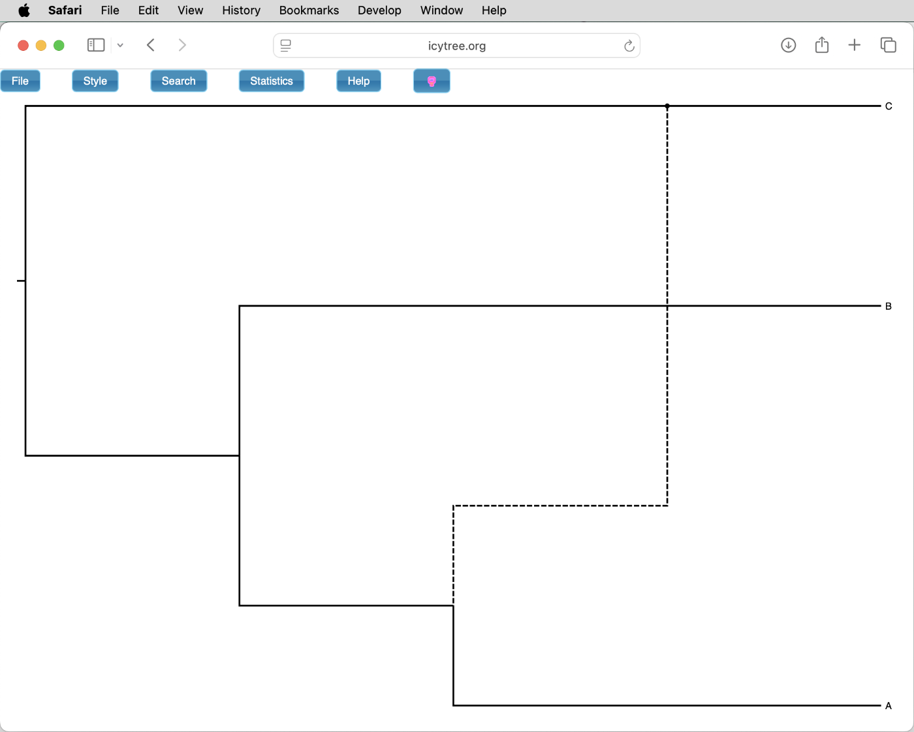
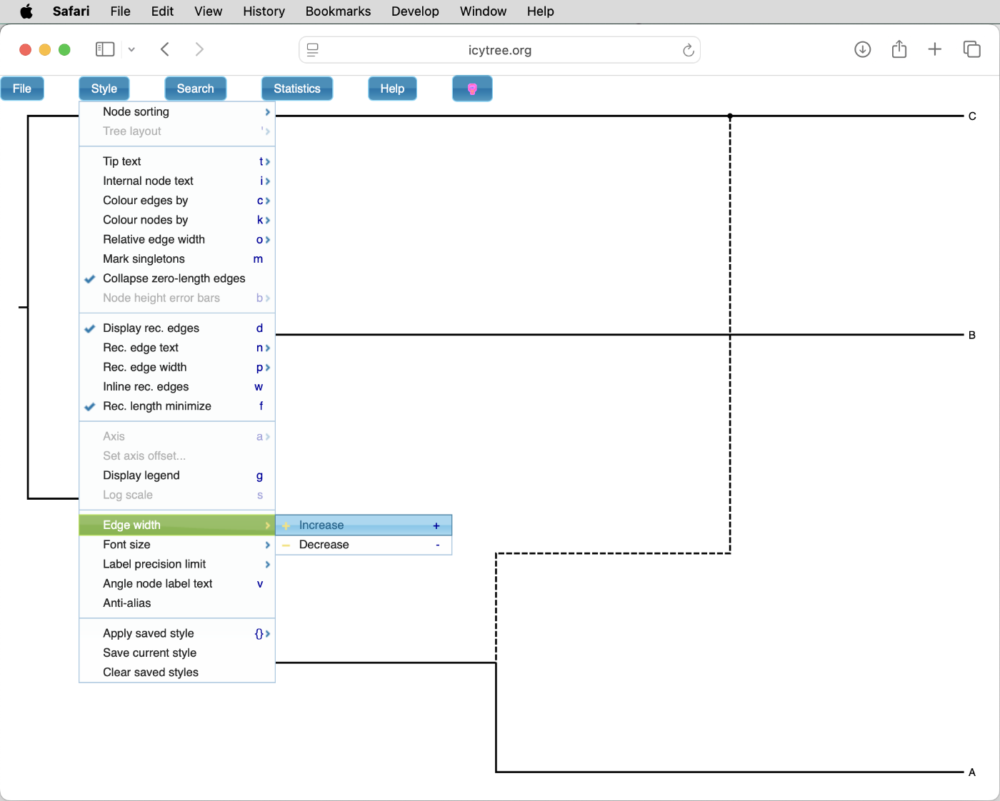
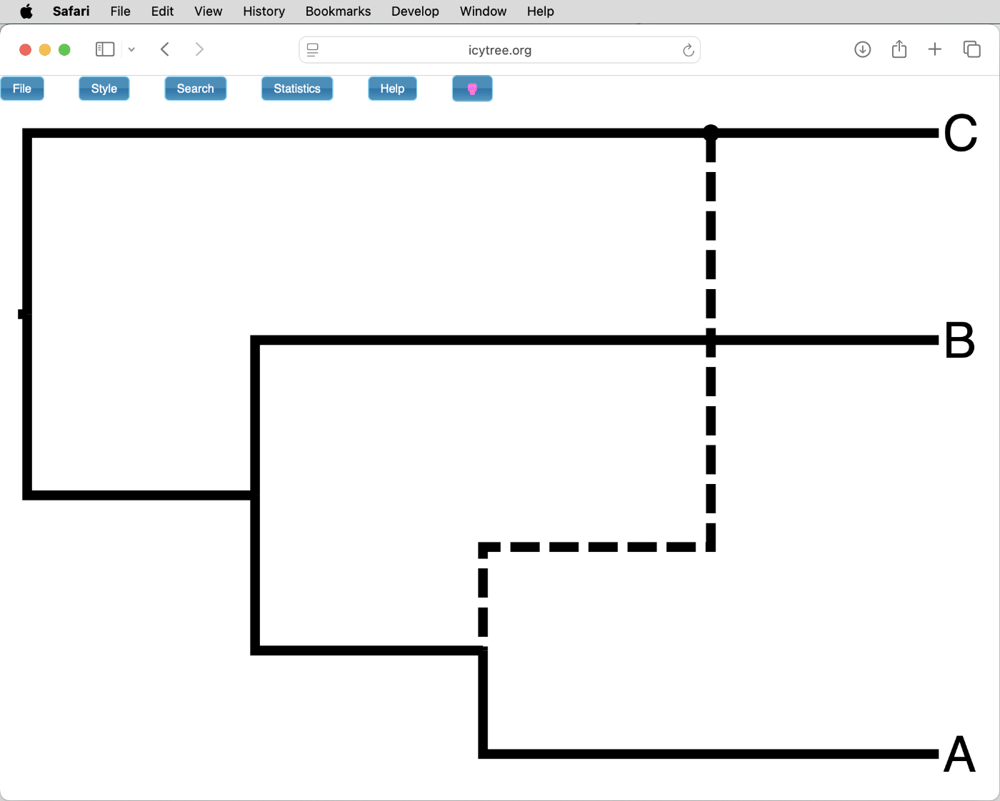
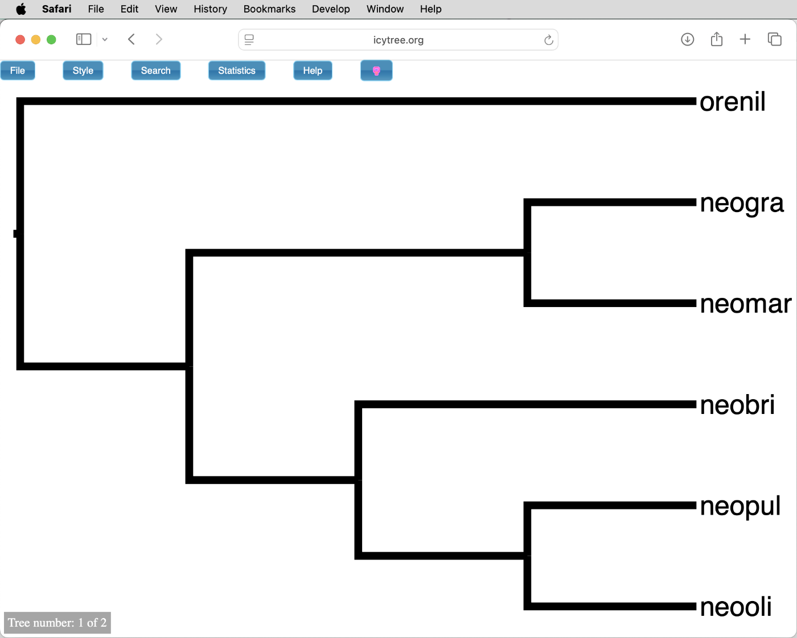
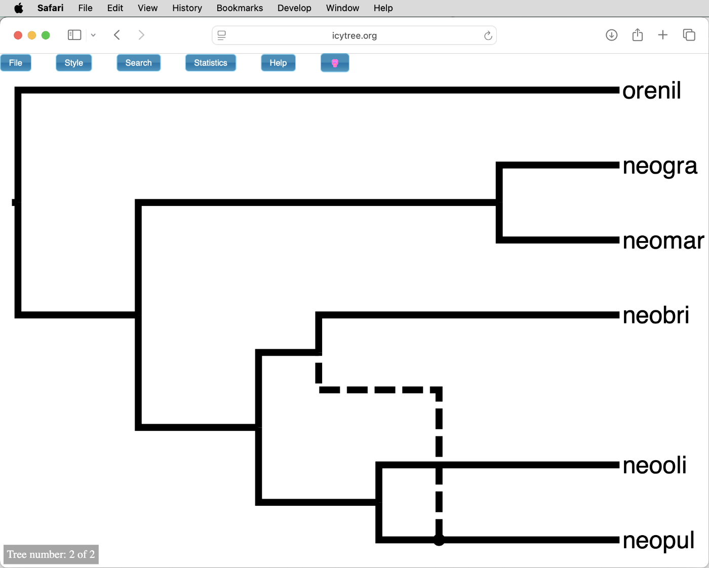

# Maximum-Likelihood Inference of Species Networks

A tutorial on maximum-likelihood phylogenetic inference of species networks

## Summary

Particularly when investigating groups of rapidly diverging species, incomplete lineage sorting (ILS) may not be the only biological process leading to variation among gene trees. Hybridization between species can lead to transfer of genetic material – so-called "introgression" between these – and thus produce gene trees that differ from the species tree. Introgression can therefore add "reticulation edges" to species trees, meaning that these are no longer bi-furcating and become a "network" instead of a tree. The identification of species networks from genomic data is still a challenging task that sees a lot of active method development. The more applicable of the currently available methods infer species networks from sets of alignments or gene trees; while a few SNP-based methods have been developed, these are so far too computationally demanding to be practical. In this tutorial, we will apply one of the earliest methods for the inference of species networks from gene trees, the "[InferNetwork\_ML](https://wiki.rice.edu/confluence/display/PHYLONET/InferNetwork_ML)" method implemented in the program [PhyloNet](https://bioinfocs.rice.edu/phylonet). This method was recently highlighted as being particularly reliable despite its speed ([Hibbins and Hahn 2022](https://doi.org/10.1093/genetics/iyab173)).

## Table of contents

* [Outline](#outline)
* [Dataset](#dataset)
* [Requirements](#requirements)
* [Extraction of alignment blocks](#alignments)
* [Scripted gene tree analyses with BEAST2](#scripted)
* [Inferring species networks with PhyloNet](#phylonet)
	* [Preparing input for PhyloNet](#preparephylonet)
	* [Running the PhyloNet analysis](#runphylonet)
	* [Visualizing species networks with IcyTree](#icytree)
	* [PhyloNet analysis without branch lengths](#nobranches)
* [Testing hypotheses of introgression with PhyloNet](#hypotheses)

## Outline

This tutorial demonstrates how phylogenies based on whole-genome sequence data can be used to detect introgression between closely related species. The dataset used in this tutorial is a set of alignments that will be extracted from the whole-genome alignments produced in tutorial [Whole-Genome Alignment](../whole_genome_alignment/README.md). This whole-genome alignment was based on assemblies of five species of *Neolamprologus* cichlid fishes from Lake Tanganyika and the Nile tilapia (*Oreochromis niloticus*) as the outgroup. Phylogenies will be inferred for each alignment with BEAST2<!-- XXX Really? XXX-->, followed by inference of the species network on the basis of these phylogenies with the "InferNetwork\_ML" method implemented in PhyloNet.

## Dataset

The dataset used in this tutorial is based on the whole-genome alignments produced in tutorial [Whole-Genome Alignment](../whole_genome_alignment/README.md). This whole-genome alignment contains sequences for five species of *Neolamprologus* cichlid fishes from Lake Tanganyika analyzed by [Gante et al. (2016)](https://doi.org/10.1111/mec.13767), as well as for Nile tilapia (*Oreochromis niloticus*), which will serve as an outgroup. 

| Species ID  | Species name                   | Tribe         |
|-------------|--------------------------------|---------------|
| orenil      | *Oreochromis niloticus*        | Oreochromini  |
| neomar      | *Neolamprologus marunguensis*  | Lamprologini  |
| neogra      | *Neolamprologus gracilis*      | Lamprologini  |
| neobri      | *Neolamprologus brichardi*     | Lamprologini  |
| neooli      | *Neolamprologus olivaceous*    | Lamprologini  |
| neopul      | *Neolamprologus pulcher*       | Lamprologini  |

Species from this group have long been suggested to hybridize, based on mitochondrial sequences ([Salzburger et al. 2002](https://doi.org/10.1046/j.0962-1083.2001.01438.x)) and AFLP data ([Sturmbauer et al. 2010](https://doi.org/10.1016/j.ympev.2010.06.018)).

## Requirements

* **PhyloNet:** The [PhyloNet](https://bioinfocs.rice.edu/phylonet) program ([Than et al. 2008](https://doi.org/10.1186/1471-2105-9-322)) implements a range of methods for the inference of species trees and networks in a maximum-likelihood, Bayesian, or parsimony framework. PhyloNet is not available as a module on lynx, but as it is written in Java, it also does not need to be compiled and can simply be downloaded and then executed. The steps required for this are described in the tutorial below.
	
* **FigTree:** The program [FigTree](http://tree.bio.ed.ac.uk/software/figtree/) is an intuitive and useful tool for the visualization and (to a limited extent) manipulation of phylogenies encoded in [Newick](http://evolution.genetics.washington.edu/phylip/newicktree.html) format. Being a GUI program, FigTree can not be run on lynx, but needs to be installed and used on your local computer (see [Requirements](../requirements/README.md)). Input files for FigTree will thus need to be downloaded from lynx. 

* **babette:** [babette](https://github.com/ropensci/babette) ([Bilderbeek and Etienne (2018)](https://doi.org/10.1111/2041-210X.13032)) is an R package that allows the generation of basic XML input files for BEAST2 through scripting instead of the BEAUti GUI. Installation of this R package is required on lynx. To install both babette as well as the Rcpp package required by it there, use the following commands:

		/opt/bin/R
		install.packages("Rcpp", repos='http://cran.us.r-project.org')
		install.packages("babette", repos='http://cran.us.r-project.org')
		quit(save="no")

	If asked whether you "would you like to use a personal library?", type "yes". These installation may take a couple of minutes.

## Extraction of alignment blocks

As the whole-genome alignment produced in tutorial [Whole-Genome Alignment](../whole_genome_alignment/README.md) is stored in MAF format, and this format can not be read by programs for phylogenetic inference, we will need to first extract sets of alignment blocks in a format such as Nexus before these can used for the analyses in this tutorial. We are going to combine this alignment extraction with some basic filtering to extract alignment blocks only from the most reliably aligned regions of the whole-genome alignment.

* Make sure that you have file `cichlids_chr5.maf` in your current tutorial working directory on lynx. If that is not the case, copy it from the directory in which you performed the Cactus analysis in tutorial [Whole-Genome Alignment](../whole_genome_alignment/README.md), or copy  a prepared version of it from `/data/share/teaching/phylogenomics/data`:

		cp /data/share/teaching/phylogenomics/data/cichlids_chr5.maf .

* Download the script `make_alignments_from_maf.py` to your current directory on lynx:

		wget https://raw.githubusercontent.com/mmatschiner/phylogenomics/refs/heads/main/ml_inference_of_species_networks/scripts/make_alignments_from_maf.py

* Have a look at the options of the script `make_alignments_from_maf.py` as explained in its help text:

		python make_alignments_from_maf.py -h
		
	You'll see that you need to specify two parameters, namely the name of an input file in MAF format and a prefix for output file name, in this order. In addition, you can specify a maximum number of alignments to be extracted from a MAF file (option `-n`), as well as a minimum length (`-l`), a maximum alignment length (`-k`), a minimum completeness (`-c`), a minimum number of sequences (`-x`), and a minimum number of polymorphic sites (`-m`) that these alignments should have. Finally, a path can be specified for where the output files should be written (`-p`).

* Run this script to extract up to 500 alignments (`-n 500`) with a length of exactly 2,500 bp (`-l 2500 -k 2500`), a completeness of at least 95% (`-c 0.95`), and a minimum of 20 polymorphic sites (`-m 20`), from the whole-genome alignment file `cichlids_chr5.maf`. Importantly, also specify that each extracted alignment should have sequences for all six species (`-x 6`). The output should be written to a directory named `alignments` (`-p alignments`), be in Fasta format `-f fasta`, and have the prefix `cichlids`:

		python make_alignments_from_maf.py cichlids_chr5.maf cichlids -n 500 -l 2500 -k 2500 -m 20 -c 0.95 -x 6 -p alignments -f fasta

	The screen output of this command should indicate that 500 alignment files have been written to directory `alignments`.
	
* Make sure that in fact the directory `alignments` contains 500 alignments in Fasta format:

		ls alignments/*.fasta | wc -l

## Scripted gene tree analyses with BEAST2

As PhyloNet requires "gene" (= in this context, a region of the genome, regardless of whether it's a gene or not) trees rather than alignments as input, we will still need to generate trees for each alignment. While PhyloNet can infer species networks only based on the topologies of gene trees, simulations have shown ([Yu et al. 2014](https://doi.org/10.1073/pnas.1407950111)) that the inference is improved when branch lengths are included. But when using branch lengths in the inference, a requirement of PhyloNet is that the trees also must be ultrametric, meaning that the tips of the phylogeny are all equally distant from the root. Because of this requirement, IQ-TREE is not suited for the inference of the gene trees. While recent versions of IQ-TREE (> 2.0) do come with an option to infer time-calibrated (and thus ultrametric) trees (e.g. the `--date` option) under maximum likelihood, these trees often contain zero-length branches that might not be handled well by PhyloNet. Therefore, it would be preferable to infer the gene trees with BEAST2, which also produces ultrametric trees (as you know), with more realistic branch length distributions than those produced by IQ-TREE. 

However, we obviously don't want to set up XML files with BEAUti for hundreds or thousands of alignments. Instead, it would be far more convenient to generate all XML files automatically with a script. This has been made possible with the release of the R package [babette](https://github.com/ropensci/babette) ([Bilderbeek and Etienne (2018)](https://doi.org/10.1111/2041-210X.13032)), which can produce basic XML files for BEAST only from an alignment in Fasta format and few specifications.

* Write an R script named `make_xml.r` that loads the babette library, reads an input file in Fasta format, and produces an input file for BEAST2 in XML format. The content of this script should be the following, specifying the HKY model of sequence evolution and a chain length of 500,000 iterations:

		# Load the babette library.
		library("babette")

		# Get the command-line arguments.
		args <- commandArgs(trailingOnly = TRUE)
		fasta <- args[1]
		xml <- args[2]

		# Define a site model based on the hky model.
		site_model <- create_hky_site_model()

		# Specify a run length of 500,000 iterations.
		mcmc <-  create_mcmc(chain_length = 500000)

		# Make an xml file with babette.
		create_beast2_input_file(fasta, xml, site_model = site_model, mcmc = mcmc)

* Because the babette R package is slightly outdated, and the XML files produced by it are no longer compatible with the latest version of BEAST2, we need to download a conversion script to update the XML files produced by babette. Download this conversion script to your tutorial directory on lynx:

		wget https://raw.githubusercontent.com/CompEvol/beast2/master/scripts/migrate.pl

* Place the script named `convert_to_newick.r` in your current tutorial directory on lynx (this is one of the short scripts that was written in tutorial [Bayesian Species-Tree Inference](../bayesian_species_tree_inference/README.md). If you should not have it, you can write it from scratch with the following content:

		# Load the ape library.
		library("ape")
		
		# Get the command-line arguments.
		args <- commandArgs(trailingOnly = TRUE)
		nexus <- args[1]
		nwk <- args[2]
		
		# Read the file with a tree in nexus format.
		tree <- read.nexus(nexus)
		
		# Write a new file with a tree in newick format.
		write.tree(tree, nwk)

	We will need this R script to convert the MCC trees produced by BEAST2 for each alignment into Newick format, because this will allow us to combine them into a single input file for PhyloNet more easily.

* To write an XML file for each alignment with script `make_xml.r`, analyze this XML file with BEAST2, summarize the posterior tree distribution in the form of an MCC tree, and then convert that MCC tree to Newick format with script `convert_to_newick.r`, we'll additionally need to write a Slurm script. This Slurm script should be named `prepare_phylonet.slurm` and have the following content:

		#!/bin/bash

		# Job name:
		#SBATCH --job-name=prep_phylonet
		#
		# Wall clock limit:
		#SBATCH --time=2:00:00
		#
		# Processor and memory usage:
		#SBATCH --ntasks=1
		#SBATCH --mem-per-cpu=1G

		# Set a variable for the directory.
		dir=alignments
		
		# Get the command-line argument.
		last_char=${1}

		# Make an xml file for beast with babette for every fasta file.
		for fasta in ${dir}/*${last_char}.fasta
		do
			xml=${fasta%.fasta}.xml
			Rscript make_xml.r ${fasta} ${xml}
		done
		
		# Convert all xml files produced by babette so that they are compatible with the latest beast version.
		for xml in ${dir}/*${last_char}.xml
		do
			perl migrate.pl ${xml}
		done
	
		# Analyze every xml file with beast.
		cd ${dir} # Go into the alignment directory to run beast there. 
		for xml in *${last_char}.xml
		do
			beast2 ${xml}
		done
		cd - # Return to previous directory.

		# Make an mcc summary tree for each posterior tree set.
		for trees in ${dir}/*${last_char}.trees
		do
			tre=${trees%.trees}.tre
			treeannotator -burnin 10 -height mean ${trees} ${tre}
		done

		# Convert each mcc summary tree to newick format.
		for tre in ${dir}/*${last_char}.tre
		do
			nwk=${tre%.tre}.nwk
			Rscript convert_to_newick.r ${tre} ${nwk}
		done

	This script uses a quick-and-dirty way allowing parallelization: The line with `last_char=${1}` stores a variable that can be specified outside of this script, when calling it with `sbatch`. When we then call this script for example with `sbatch prepare_phylonet.slurm 0`, the variable "0" is passed into it and used to process only a subset of files. The line `for fasta in ${dir}/*${last_char}.fasta` for example then loops over all Fasta file in the alignment directory that end in `0.fasta`. We can therefore submit this script ten times with `sbatch prepare_phylonet.slurm 0` to `sbatch prepare_phylonet.slurm 9` to process all alignment files with ten parallel analyses. This will allow us to reduce the run time from over 2 hours to about 20 minutes.

* Submit this new Slurm script ten times with `sbatch` using the following loop:

		for i in {0..9}
		do
			sbatch -o prepare_phylonet.${i}.out prepare_phylonet.slurm ${i}
		done

	As the script runs, it should first add XML files to the alignment directory, then BEAST2's output files, then the MCC summary trees, and finally files with the MCC trees converted to Newick format.
	
* Occasionally monitor the progress of the script `prepare_phylonet.slurm` by checking how many files with the endings `.xml`, `.trees`, `.tre`, and `.nwk` have already been written:

		ls alignments/*.xml | wc -l
		ls alignments/*.trees | wc -l
		ls alignments/*.tre | wc -l
		ls alignments/*.nwk | wc -l

	Compare these numbers to the number of alignment files in Fasta format:
	
		ls alignments/*.fasta | wc -l

* When the Slurm jobs have finished, make sure that the expected number of files with the ending `.nwk` has been written:

		ls alignments/*.nwk | wc -l

## Inferring species networks with PhyloNet

### Preparing input for PhyloNet

* Next, we need to write the input file for PhyloNet. Have a look at the examples given on the [website](https://wiki.rice.edu/confluence/display/PHYLONET/InferNetwork_ML) for PhyloNet's `InferNetwork_ML` command, which is the command that we will use, to learn about the format required for it.

	As you'll see when you scroll to the Examples section on the above website, the file format used by PhyloNet is also Nexus format, including one Nexus block with trees as well as one block that is specific for PhyloNet and contains the commands for the PhyloNet analysis.
	
* Still on the website for PhyloNet's `InferNetwork_ML` command, scroll back to the top of the website.

	In the box just below "Usage", you should see that the `InferNetwork_ML` command can be called with just two options, called `geneTreeList` and `numReticulations`. The first of these should be a list of the IDs of the gene trees, in parentheses and separated by commas, and the second should be a number specifying the maximum number of reticulation edges that should be tested. If there are sufficiently strong introgression signals in the dataset, this number of reticulation edges will be placed on the phylogeny by PhyloNet, but if there is not sufficient support for introgression, a lower number or zero reticulation edges will be inferred. It is recommended to first limit the maximum number of reticulations, because the analysis can quickly become very computationally demanding with increasing numbers of reticulation events.
	
	All of the other options can be ignored, except the `-bl` option, with which we can specify that the branch lengths should be used in the inference.

* Write a script named `prepare_phylonet.sh` to collect the tree strings in Newick format from the files with the `.nwk` ending that were written by the `prepare_phylonet.slurm` script, and to write an input file for PhyloNet with that information. The script should have the following content:

		# Set the directory with alignments.
		dir=alignments

		# Set the name of the nexus file.
		nex=phylonet.nex

		# Write a nexus file with all trees.
		echo -e "#NEXUS\n\nBEGIN TREES;\n" > ${nex}
		count=1
		for tre in ${dir}/*.nwk
		do
			echo -n "Tree gt${count} = " >> ${nex}
			cat ${tre} >> ${nex}
			count=$(( ${count} + 1 ))
		done
		echo -e "\nEND;\n\n" >> ${nex}

		# Add a phylonet block to the nexus file.
		echo -e "BEGIN PHYLONET;\n" >> ${nex}
		echo -e "InferNetwork_ML (all) 1 -bl;" >> ${nex}
		echo -e "\nEND;" >> ${nex}

* Execute the new script `prepare_phylonet.sh`:

		bash prepare_phylonet.sh
		
* When the script has finished, have a look at the file that it has written, named `phylonet.nex`, for example with `less`:

		less phylonet.nex
		
	On the line with the `InferNetwork_ML` command, you'll see that instead of the list of gene trees that should be provided, the first parameter that is passed to the command is "(all)". This is a special value that is understood by the command as a shorthand for all gene tree IDs.
	
	The second parameter that is passed to the command is the number "1", meaning that we allow the inference of up to 1 reticulation edge in this analysis.
	
	Finally, the `-bl` option is invoked, specifying that we want to use the branch lengths of the gene trees in the inference.

### Running the PhyloNet analysis

* To run PhyloNet with the input file `phylonet.nex`, a Slurm script is required as the last script for this analysis. Write this Slurm script with the name `run_phylonet.slurm` and the following content:

		#!/bin/bash

		# Job name:
		#SBATCH --job-name=phylonet
		#
		# Wall clock limit:
		#SBATCH --time=3:00:00
		#
		# Processor and memory usage:
		#SBATCH --ntasks=1
		#SBATCH --mem-per-cpu=10G
		#
		# Output:
		#SBATCH --output=run_phylonet.out

		# Run phylonet.
		java -jar PhyloNet.jar phylonet.nex

* Before we can run PhyloNet, the program still needs to be downloaded from its GitHub repository:

		wget https://github.com/NakhlehLab/PhyloNet/releases/latest/download/PhyloNet.jar

* Then, submit the script `run_phylonet.slurm` with `sbatch`:

		sbatch run_phylonet.slurm

	This PhyloNet analysis should take no longer than a few minutes.

* When the PhyloNet analysis has finished, have a look at the screen output that was sent by `sbatch` to the file named `run_phylonet.out`:

		less run_phylonet.out
	
	You should see a list of gene tree IDs, followed by the network with the best log-probability on the line after "Inferred Network #1":
	
		Inferred Network #1:
		(orenil:0.0060747969823,(neomar:2.113888037E-4,(neopul:1.288168681E-4,((neooli:1.109179136E-4,neobri:1.109179136E-4):1.43505188E-5,neogra:1.252684324E-4):3.548435700000005E-6):8.257193559999999E-5):0.005863408178600001);

	If PhyloNet in fact found support for a reticulation edge (we allowed maximally one), the network should contain two occurrences of the keyword "#H1", indicating the connection points of the reticulation edge. The specification is then not strictly in Newick format anymore, but instead in "extended Newick" format, which is described in [Cardona et al. (2008)](https://doi.org/10.1186/1471-2105-9-532). The format is extremely difficult to read by eye, and FigTree is also unable to read it. To visualize the network, other programs must be used. One tool capable of reading and visualizing extended Newick format is Dendroscope ([Huson et al. 2007](https://doi.org/10.1186/1471-2105-8-460)), but we'll here use an easier-to-use alternative, the browser-based tree viewer [IcyTree](https://icytree.org) ([Vaughan 2017](https://doi.org/10.1093/bioinformatics/btx155)).

### Visualizing species networks with IcyTree

* To see how species networks in extended Newick format are visualized with IcyTree, write the following text to a new file on your local computer, that you could for example name `tmp.tre`:

		#nexus
		begin trees;
			tree example = (((A,#H1),B),(C)#H1);
		end;

	As you may guess, this text encodes a species network in which "A" and "B" are sister species, and a hybridization branch connects "A" with the outgroup "C".

* Open the [IcyTree webpage](https://icytree.org) in a browser and load the file `tmp.tre` that you just wrote. As expected, the tree includes a hybridization branch that connects species "A" and "C", as shown in the next screenshot.

* You could browse the style settings of IcyTree to learn a bit about how to optimize the visualization. For example, you could change the width of the branches by clicking "Edge width" > "Increase" in IcyTree's "Style" menu as in the next screenshot. You may need to click on it multiple times to see a difference.

* You could also to increase the font size for the tip labels, as shown below. click on "Font size" > "Increase" in the "Style" menu multiple times, the network will look as shown below.

* Copy the extended Newick string with the network in file `run_phylonet.out` (just below "Inferred Network #1:") and use it to replace the content of file `tmp.tre`, on your local computer.

* Load the file `tmp.tre` with its new content once again in IcyTree.

	**Question 1:** Did PhyloNet infer a network with a reticulation edge or merely a tree without any? [(see answer)](#q1)

* If PhyloNet inferred a reticulation edge, note the log-likelihood of the species network and repeat the inference without allowing any reticulation, and with a maximum of two allowed reticulation edges. To do that, open `phylonet.nex` in a text editor, and replace the line `InferNetwork_ML (all) 1 -bl;` with either `InferNetwork_ML (all) 0 -bl;` or `InferNetwork_ML (all) 2 -bl;`. Then, resubmit the Slurm script `run_phylonet.slurm` and wait for it to finish. The new output should then be appended to the existing file `run_phylonet.out`. Again note the log-likelihoods found for the network without reticulation edges (actually not a network but a tree) and the network with two reticulation edges (if such two edges were supported by the alignments).

* Compare the log-likelihoods for the networks with zero, one, and two reticulation edges if PhyloNet should have found support for reticulation edges. Assuming that the networks with more reticulation edges are identical to those with less reticulation edges except for the added reticulation edge, we can use a likelihood-ratio test to assess whether or not the additional reticulation edge significantly improved the likelihood. The table below may be helpful for this comparison.
 
	| Difference between log-likelihoods | p-value |
	|------------------------------------|---------|
	| < 1.92073                          | > 0.05  |
	| > 1.92073                          | < 0.05  |
	| > 3.31745                          | < 0.01  |
	| > 5.41375                          | < 0.001 |

### PhyloNet analysis without branch lengths

If there is time left, you could repeat the PhyloNet analysis with gene trees without branch lengths. These trees can be inferred under maximum likelihood with IQ-TREE. The comparison of the results of this PhyloNet analysis with the previous one might then shed light on the effect that the types of gene trees and the inclusion of branch lengths have.

* Write a script named `prepare_phylonet_nobl.slurm` to run an IQ-TREE analysis for each Fasta file in the directory `alignments`. The script should have the following content:

		#!/bin/bash

		# Job name:
		#SBATCH --job-name=prep_phylonet_nobl
		#
		# Wall clock limit:
		#SBATCH --time=1:00:00
		#
		# Processor and memory usage:
		#SBATCH --ntasks=1
		#SBATCH --mem-per-cpu=1G
		#
		# Output:
		#SBATCH --output=prepare_phylonet_nobl.out

		# Set a variable for the directory.
		dir=alignments

		# Infer a tree for every fasta file.
		for fasta in ${dir}/*.fasta
		do
			iqtree3 -s ${fasta} -o orenil
		done

		# Clean up.
		rm alignments/*.bionj
		rm alignments/*.ckp.gz
		rm alignments/*.iqtree
		rm alignments/*.mldist
		rm alignments/*.model.gz
		rm alignments/*.fasta.log

* Submit this script with `sbatch`:

		sbatch prepare_phylonet_nobl.slurm
		
	This script should complete within a few minutes.
	
* The tree files written by IQ-TREE should have the ending ".fasta.treefile". Make sure that you have the expected number of files with this ending:

		ls alignments/*.treefile | wc -l

* To prepare the new PhyloNet input file, first copy file `prepare_phylonet.sh` to a new file named `prepare_phylonet_nobl.sh`:

		cp prepare_phylonet.sh prepare_phylonet_nobl.sh

* Edit the new file `prepare_phylonet_nobl.sh` so that it has the following content:

		# Set the directory with alignments.
		dir=alignments

		# Set the name of the nexus file.
		nex=phylonet_nobl.nex

		# Write a nexus file with all trees.
		echo -e "#NEXUS\n\nBEGIN TREES;\n" > ${nex}
		count=1
		for tre in ${dir}/*.treefile
		do
			echo -n "Tree gt${count} = " >> ${nex}
			cat ${tre} >> ${nex}
			count=$(( ${count} + 1 ))
		done
		echo -e "\nEND;\n\n" >> ${nex}

		# Add a phylonet block to the nexus file.
		echo -e "BEGIN PHYLONET;\n" >> ${nex}
		echo -e "InferNetwork_ML (all) 1;" >> ${nex}
		echo -e "\nEND;" >> ${nex}

	Note the changes on lines 5, 10, and the second-last line: The output Nexus file is now called `phylonet_nobl.nex` (on line 5), the input tree files on now have the ending `.treefile` (on line 10), and the `InferNetwork_ML` command is now called without the option `-bl` (on the second-last line).
	
* Execute the new script `prepare_phylonet_nobl.sh`:

		bash prepare_phylonet_nobl.sh

* Prepare a new Slurm script for this new PhyloNet analysis, by copying file the first Slurm script `run_phylonet.slurm` to a new file named `run_phylonet_nobl.slurm`:

		cp run_phylonet.slurm run_phylonet_nobl.slurm

* Change the job name to `phylonet_nobl` (on line 4), the screen output file name to `run_phylonet_nobl.out` (on line 14), and the input file name for PhyloNet to `phylonet_nobl.nex` (on the last line), so that the Slurm script has the following content:

		#!/bin/bash

		# Job name:
		#SBATCH --job-name=phylonet_nobl
		#
		# Wall clock limit:
		#SBATCH --time=3:00:00
		#
		# Processor and memory usage:
		#SBATCH --ntasks=1
		#SBATCH --mem-per-cpu=10G
		#
		# Output:
		#SBATCH --output=run_phylonet_nobl.out

		# Run phylonet.
		java -jar PhyloNet.jar phylonet_nobl.nex

* Then, submit this Slurm script with `sbatch`:

		sbatch run_phylonet_nobl.slurm

	This analysis might take longer than the previous one. You could therefore move on to the next part of this tutorial and complete the next step afterwards.

* When this second PhyloNet analysis has finished, copy once again the string with the network from the screen output file `run_phylonet_nobl.out` to a new file on your local computer, save this file under any name, and load it from the IcyTree website.

	**Question 2:** How is the resulting network affected by the different trees used as input and the fact that branch lengths were not used this time? [(see answer)](#q2)

## Testing hypotheses of introgression with PhyloNet

If we had *a priori* hypotheses for how the species within the dataset could be related to each other and how they might be connected by introgression, but the "InferNetwork\_ML" method of PhyloNet did not infer species networks matching our hypotheses, we might still be interested in whether the data support one of our hypotheses more strongly than the other. For example we might want to compare the support for one hypothesis that completely excludes introgression with another that allows introgression between a certain species pair. This is possible with a second method implemented in PhyloNet, which is called "CalGTProb". Like the "InferNetwork\_ML" method, this method also uses a set of gene trees as input, but unlike "InferNetwork\_ML", it does not infer a species network from these. Instead it uses the set of gene trees together with a specified species network to calculate only the likelihood of that network. The Nexus file used by the command `CalGTProb` therefore includes three blocks: One in which the species network is specified in extended Newick format, one in which the gene trees are listed, and finally the one with the command for PhyloNet.

* Have a look at the [website](https://wiki.rice.edu/confluence/display/PHYLONET/CalGTProb+Command) for the command `CalGTProb` to see the examples for Nexus files that are given at the end of the website.

We'll use the `CalGTProb` command to assess the relative support of two hypotheses: The null hypothesis that assumes no introgression, and the alternative hypothesis in which introgression occurred between *Neolamprologus brichardi* ("neobri") and *Neolamprologus pulcher* ("neopul"). In both cases, the species relationship is assumed to be according to the most strongly supported phylogeny found for these species by [Bouckaert et al. (2019)](https://doi.org/10.1371/journal.pcbi.1006650). The corresponding strings in extended Newick format are listed below.

Null hypothesis: "(orenil,((neomar,neogra),(neobri,(neooli,neopul))));"
		
Alternative hypothesis: "(orenil,((neomar,neogra),((neobri,X#H1),(neooli,(neopul)X#H1))));"

* To visualize both hypotheses, write a new file on your local computer with the following two lines:

		(orenil,((neomar,neogra),(neobri,(neooli,neopul))));
		(orenil,((neomar,neogra),((neobri,X#H1),(neooli,(neopul)X#H1))));
		
* Then, open IcyTree in a browser on your local computer and load the file with these two lines. After adjusting font sizes and edge widths, the first hypothesis should be visualized as shown in the below screenshot:

 When you then click on the arrow in the bottom left, the second hypothesis should be visualized as shown below.

		
* On lynx, copy the existing file `phylonet.nex` to two new files named `phylonet_null.nex` and `phylonet_alt.nex`:

		cp phylonet.nex phylonet_null.nex
		cp phylonet.nex phylonet_alt.nex

* Then open file `phylonet_null.nex` in a text editor on lynx and add the following block after the keyword "#NEXUS" on the first line and before the line with "BEGIN TREES;":

		BEGIN NETWORKS;
		
		Network null_hypothesis = (orenil,((neomar,neogra),(neobri,(neooli,neopul))));
		
		END;

* Also replace the line with the `InferNetwork_ML` command with the following line:

		CalGTProb null_hypothesis (all) -o;
		
	The option `-o` on this line specifies that the network provided by us consists only of a topology, without branch lengths.
	
* Edit the file `phylonet_alt.nex` in the same way. Add the following block after the keyword "#NEXUS" on the first line and before the line with "BEGIN TREES;":

		BEGIN NETWORKS;

		Network alt_hypothesis = (orenil,((neomar,neogra),((neobri,X#H1),(neooli,(neopul)X#H1))));
		
		END;
		
* Replace the line with the `InferNetwork_ML` command with the following line:

		CalGTProb alt_hypothesis (all) -o;

* Analyze both of these new input files with PhyloNet. As these analyses are quite fast, we can run these without a Slurm script:

		java -jar PhyloNet.jar phylonet_null.nex
		java -jar PhyloNet.jar phylonet_alt.nex

* Compare the log-likelihood values reported on the last line of the screen output in both cases.

	**Question 3:** Is the likelihood difference sufficient to conclude that introgression occurred between *Neolamprologus brichardi* ("neobri") and *Neolamprologus pulcher* ("neopul")? [(see answer)](#q3)

 

                   

## Answers

* **Question 1:** The answer may vary in each case, and depend on the alignment blocks that were extracted from the whole-genome alignment, the gene trees that were inferred by BEAST2, and whether PhyloNet found the maximum likelihood or not. All of these analysis steps included stochastic elements and may not always produce the same result.

* **Question 2:** The result might be quite different from the one obtained in the first PhyloNet analysis. In my case, the first analysis with PhyloNet that included branch lengths did not find support for a reticulation edge, while the second analysis without branch lengths in the gene trees produced a species network in which the ancestor of *Neolamprologus marunguensis* ("neomar") and *Neolamprologus gracilis* ("neogra") were connected with the ancestor of *Neolamprologus pulcher* ("neopul")  and *Neolamprologus olivaceus* ("neooli").

	In my view, these differences illustrate how the likelihood surface can be highly complex when species networks are inferred, and that maximum-likelihood approaches can therefore often produce results that are not particularly robust to minor changes in the model, or even to re-analyses with the same model. Species networks obtained with maximum-likelihood approaches should therefore be corroborated with other approaches, such as <!--Bayesian inference (see tutorial [Bayesian Inference of Species Networks](../bayesian_inference_of_species_networks/README.md)) or -->tests of introgression based on tree-topology comparisons (see tutorial [Analyses of Introgression with Tree Topologies](../analysis_of_introgression_with_tree_topologies/README.md)) or SNPs (see tutorial [Analysis of Introgression with SNP Data](../analysis_of_introgression_with_snp_data/README.md)), before drawing conclusions about introgression.

* **Question 3:** This may be the case. In my analysis, the log-likelihood of the null hypothesis no introgression was -2172.0, while the log-likelihood of the alternative hypothesis, with introgression between *Neolamprologus brichardi* ("neobri") and *Neolamprologus pulcher* ("neopul"), was -2161.2. The likelihood difference was thus over 10 log units, which translates to a *p*-value below 0.001, allowing us to reject the null hypothesis without introgression. Note, however, that this comparison was made under the assumption that the true tree topology is the one that we specified, and if that should have been incorrect, the support for introgression from the likelihood comparison could be misleading.