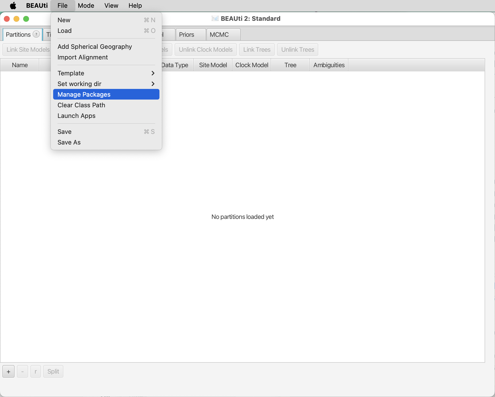
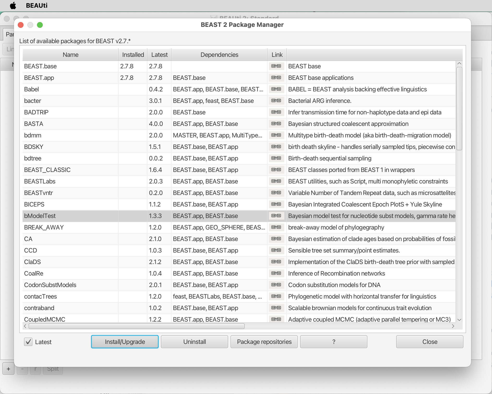

# Requirements

Most analyses of the tutorials of the Phylogenomics course will be conducted using the lynx server of the Matschiner research group at LMU Munich, where the required tools are installed. There are a few exceptions, however, where the use of Graphical User Interface (GUI) programs will be required or beneficial; these should therefore be installed locally.

## Graphical User Interface programs

* **A console program:** A console program is essential to connect to and work on servers like lynx. On MacOSX, the standard console program is called [Terminal](https://en.wikipedia.org/wiki/Terminal_(macOS)). On Linux, several options are available, including [Konsole](https://en.wikipedia.org/wiki/Konsole). If you're a Linux user, you're likely familiar with console programs. On recent Windows systems, a console program is also installed and should be called [Windows Terminal](https://en.wikipedia.org/wiki/Windows_Terminal).

* **AliView:** To visualize sequence alignments, the software [AliView](http://www.ormbunkar.se/aliview/) ([Larsson 2014](https://academic.oup.com/bioinformatics/article/30/22/3276/2391211)) is recommended. The installation of AliView is described at [http://www.ormbunkar.se/aliview/](http://www.ormbunkar.se/aliview/) and should be possible on all operating systems.

* **BEAST2:** BEAST2 is a program for Bayesian phylogenetic analyses, that comes bundled with other tools, such as BEAUti (used to prepare BEAST2 input) and TreeAnnotator (used to process BEAST2 output). While the phylogenetic analysis itself will be performed on the lynx server, where BEAST2 and TreeAnnotator are already installed, input preparation will require the Graphical User Interface program BEAUti, which therefore also needs to be installed on your local computer. The BEAST2 package can be downloaded from the BEAST2 website [https://www.beast2.org](https://www.beast2.org). As all programs of the package are written in Java, compilation is not required, and all programs should work on Mac OS, Linux, and Windows. 

* **Tracer:** The program [Tracer](http://beast.community/tracer) facilitates the inspection of output from Bayesian analyses such as those done with BEAST2. It is a GUI program that therefore can not be used on lynx, but it is easy to install on your local computer. Input files for Tracer will thus need to be downloaded from lynx after BEAST2 analyses. Executables of Tracer for MacOS, Linux, and Window can be found on [https://github.com/beast-dev/tracer/releases](https://github.com/beast-dev/tracer/releases).

* **FigTree:** The program [FigTree](http://tree.bio.ed.ac.uk/software/figtree/) is an intuitive and useful tool for the visualization and (to a limited extent) manipulation of phylogenies encoded in [Newick](http://evolution.genetics.washington.edu/phylip/newicktree.html) format. Being a GUI program, FigTree can not be run on lynx, but needs to be installed and used on your local computer. Input files for FigTree will thus need to be downloaded from lynx. Executables of FigTree for Mac OS, Linux, and Windows are provided on [https://github.com/rambaut/figtree/releases](https://github.com/rambaut/figtree/releases). Download the file [FigTree.v1.4.4.dmg](https://github.com/rambaut/figtree/releases/download/v1.4.4/FigTree.v1.4.4.dmg) if your local computer is running MacOS, [FigTree_v1.4.4.tgz](https://github.com/rambaut/figtree/releases/download/v1.4.4/FigTree_v1.4.4.tgz) if it is running Linux, and [FigTree.v1.4.4.zip](https://github.com/rambaut/figtree/releases/download/v1.4.4/FigTree.v1.4.4.zip) if it is running Windows.

* **RStudio:** [RStudio](https://www.rstudio.com/products/rstudio/) is an integrated development environment (IDE) for [R](https://www.r-project.org/). It includes a console, syntax-highlighting editor that supports direct code execution, as well as tools for plotting, history, debugging and workspace management. RStudio is available in open source and commercial editions and runs on the desktop (Windows, Mac, and Linux) or in a browser connected to RStudio Server or RStudio Server Pro (Debian/Ubuntu, Red Hat/CentOS, and SUSE Linux). Download the program [RStudio Desktop](https://www.rstudio.com/products/rstudio/download/). You have to choose the free version, which is not for the server. You will also have to install [R 3.6.0+](https://cran.rstudio.com/) on your computer before you install R Studio. Choose the OS appropriate for your computer.

## Add-on packages

* **bModelTest:** The [bModelTest](https://github.com/BEAST2-Dev/bModelTest) ([Bouckaert and Drummond 2017](https://bmcevolbiol.biomedcentral.com/articles/10.1186/s12862-017-0890-6)) add-on package for BEAST2 enables automated substitution model selection as part of BEAST2 analyses. This package needs to be installed on your local computer, because it will be required to generate input for BEAST2 (which will be done on the local computer). The installation is done through BEAST2's PackageManager tool that is accessible through BEAUti. To find it, open BEAUti, and click on "Manage Packages" in BEAUti's "File" menu, as shown in the next screenshot.

	This will open the BEAST2 Package Manager as shown in the next screenshot. Select "bModelTest" and click on "Install/Upgrade".

You will see a notice that any changes will only take effect after you restart BEAUti; thus, do so.
	In addition to the installation on your local computer, the bModelTest add-on package will also need to be installed for every user on the lynx server; however, this installation on lynx consist of a single command that will be described in the respective tutorial.

* **StarBeast3:** The [StarBeast3](https://github.com/rbouckaert/starbeast3) ([Douglas et al. 2022](https://doi.org/10.1093/sysbio/syac010)) add-on package for BEAST2 allows species-tree inference under the multi-species coalescent model. It needs to be installed on your local computer in the same way as bModelTest, through BEAST2's PackageManager tool in BEAUti.

## Libraries

* Several code libraries for R and Python will need to be installed by individual users on the lynx server; these are described in the respective tutorials.