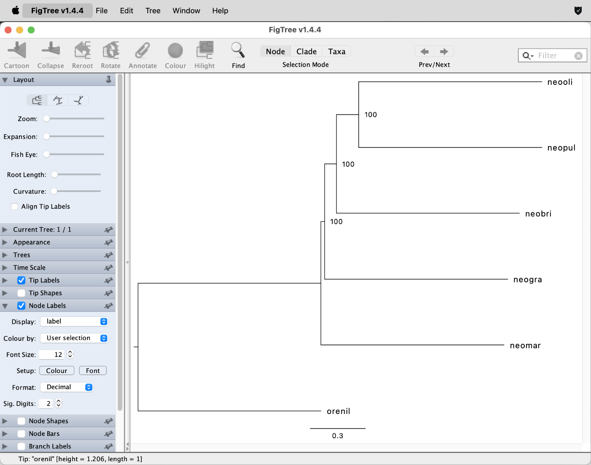

# Whole Genome Alignment

A tutorial on multiple whole genome alignment with Cactus

## Summary

Large scale projects such as Earth BioGenome Project ([Lewin et al. 2018](https://doi.org/10.1073/pnas.1720115115)), the Vertebrate Genomes Project ([Rhie et al. 2021](https://doi.org/10.1038/s41586-021-03451-0)), and other similar efforts, aspire to produce high-quality genome assemblies for all living species. As these project are ongoing, more and more highly contiguous genome assemblies are therefore being deposited in public databases, and provide an increasingly useful resource for phylogenomic analyses.

To actually understand these genomes, we need some way of analysing them comparatively. For most phylogenomic approaches, homologous regions among the genomes must be identified. This can be achieved by searching for certain markers (e.g., genes or UCE elements) in each genome, and many researchers use tools like OrthoFinder ([Emms and Kelly 2019](https://doi.org/10.1186/s13059-019-1832-y)) for this purpose. Also, BUSCO – a program that primarily aims to assess assembly completeness by searching for conserved genes – is commonly employed because the conserved gene sequences can be exported and then may provide a suitable phylogenomic dataset.

However, these approaches that identify certain markers for phylogenomic analyses usually leave the largest part of the genome unused. Whole-genome alignment, on the other hand compares all input assemblies with all other ones, yielding an enormous amount of information about homology. Based on this information, many, and sometimes very long, regions of one-to-one orthology can be identified and processed for phylogenomic analyses. Whole-genome alignment has therefore long seen as a sort of holy grail for phylogenomics, with the potential to multiply the amount of data that can be used, particularly for more divergent groups of species (for close relatives, mapping read data to the same references also allows the generation of large suitable datasets, even though these usually require other tools to work with). Unfortunately, however, whole-genome alignment is extremely computationally challenging, and scalable software solutions have only begun to appear within the last few years. The forerunner program in this field is Cactus ([Armstrong et al. 2020](https://doi.org/10.1038/s41586-020-2871-y)), which we are going to explore in this tutorial.

## Table of contents

* [Outline](#outline)
* [Dataset](#dataset)
* [Requirements](#requirements)
* [Softmasking with Red](#softmask)
* [Data subsetting](#subset)
* [Alignment-free phylogeny inference](#waster)
* [Running Cactus](#cactus)

## Outline

In this tutorial, we will produce a whole-genome alignment for six genome assemblies of varying quality. This requires masking repeats in the genomes and providing a guide tree of the species involved. Due to the large computational requirements of whole-genome alignment, it may not be possible to run the full Cactus analysis; however, result files have been prepared and can be used for downstream analyses.

## Dataset

The dataset used in this tutorial consists of genome assemblies for a subset of the species that were used in tutorial [Bayesian Species-Tree Inference](../bayesian_species_tree_inference/README.md). The rather fragmented genome assemblies for four species of the cichlid genus *Neolamprologus* (*N. marunguensis*, *N. gracilis*, *N. olivaceous*, and *N. pulcher*) were produced from Illumina sequencing data by [Gante et al. (2016)](https://doi.org/10.1111/mec.13767). Additionally, a fifth genome assembly for *Neolamprologus brichardi* had been released earlier by [Brawand et al. (2014)](https://doi.org/10.1038/nature13726). The five *Neolamprologus* species co-occur in Lake Tanganyika in East Africa. Finally, the chromosome-level genome assembly for Nile tilapia, *Oreochromis niloticus*, is used as an outgroup and was published by [Conte et al. (2019)](https://doi.org/10.1093/gigascience/giz030). While these genome assemblies are rather old today, many newly produced assemblies are still similarly fragmented, for example because no fresh tissue could be obtained. Therefore, these old genome assemblies provide a good, still-useful test case for phylogenomic analysis based on whole-genome alignment.

| ID      | Species                       | Distribution           |
|---------|-------------------------------|------------------------|
| neobri  | *Neolamprologus brichardi*    | Lake Tanganyika        |
| neomar  | *Neolamprologus marunguensis* | Lake Tanganyika        |
| neogra  | *Neolamprologus gracilis*     | Lake Tanganyika        |
| neooli  | *Neolamprologus olivaceous*   | Lake Tanganyika        |
| neopul  | *Neolamprologus pulcher*      | Lake Tanganyika        |
| orenil  | *Oreochromis niloticus*       | Central African rivers |

## Requirements

* **Cactus**: The program [Cactus](https://github.com/ComparativeGenomicsToolkit/cactus) ([Armstrong et al. 2020](https://doi.org/10.1038/s41586-020-2871-y)) is the most scalable tool for whole-genome alignment out there. The program is installed on lynx, and can be called with `cactus` after activating the corresponding Cactus conda environment. The commands to do so are described in the tutorial. Additionally, however, a set of programs associated with Cactus need to be downloaded by each user, by executing the following commands:

		wget https://github.com/ComparativeGenomicsToolkit/cactus/releases/download/v3.1.2/cactus-bin-v3.1.2.tar.gz
		tar -xzf cactus-bin-v3.1.2.tar.gz
		mv cactus-bin-v3.1.2 ~/cactus
		rm cactus-bin-v3.1.2.tar.gz
		
	A rather large number of programs that are part of the Cactus package can then be found in `~/cactus/bin`.
		
* **WASTER**: The program [WASTER](https://github.com/chaoszhang/ASTER/blob/master/tutorial/waster.md) ([Zhang and Nielsen](https://doi.org/10.1101/2025.01.20.633983)) allows alignment-free phylogeny inference from kmers extracted from Fasta or Fastq files. WASTER is part of the [ASTER*]((https://github.com/chaoszhang/ASTER)) ([Zhang et al. 2025](https://doi.org/10.1093/molbev/msaf172)) software package that was installed on lynx in tutorial [Maximum-Likelihood Species-Tree Inference](../ml_species_tree_inference/README.md). It can be called with  `waster`.

* **Red**: The program [Red](https://github.com/BioinformaticsToolsmith/Red) (short for "Repeat detection") ([Giris 2015](https://doi.org/10.1186/s12859-015-0654-5)) allows rapid soft-masking of repetitive regions in a genome assembly. It is installed as part of the Cactus program package, and should be available in `~/cactus/bin` after the steps described above for the Cactus installation. To test the availability of Red, try the following command:

		~/cactus/bin/Red

* **Minimap2**: The program [Minimap2](https://github.com/lh3/minimap2) ([Li 2018](https://doi.org/10.1093/bioinformatics/bty191)) is an efficient alignment program for long sequences. It is installed on lynx and can be called with `minimap2`.

## Softmasking with Red

Repetitive sequences are sequences that are identical or very similar, occurring at multiple locations in a genome. For instance, repetitive sequences include microsatellites or transposable elements that copy themselves multiple times across the genome. These repetitive sequences will lead to large numbers of comparisons in alignments unless they are removed from the analysis in some way. The usual approach to do so is by "masking" them. "Hard masking" means that repetitive regions of the genome are replaced with "N"s so that sequence information is effectively removed, while "soft masking" retains all sequence information, but marks repetitive sequences with lower case letters (standard Fasta format uses upper case letters). Even though the sequence information is still present with soft masking, alignment programs are usually written so that they recognize these masked regions and do not initiate alignments within such regions (however, alignments initiated outside of softmasked regions can be extended into these regions).

One of the most common approaches for repeat masking is to create a species specific repeat library with [RepeatModeler](http://www.repeatmasker.org/RepeatModeler/) ([Flynn et al (2020)](https://doi.org/10.1073/pnas.1921046117)) and to use that library to mask the genome with [RepeatMasker](https://www.repeatmasker.org/). The combination of these two tools is computationally rather demanding, though. For example, running both programs for a bird genome (about 1 Gbp) took around over 20 hours with 40 CPUs. While the combination of RepeatModeler and RepeatMasker may be the best option for users interested in the repeats themselves (asking, for example, where certain transposable elements in the genome), running these tools is not required when the goal is merely to mask the repeats, as it is here. In that case, the program Red ([Giris 2015](https://doi.org/10.1186/s12859-015-0654-5)) is a much faster solution. We will run Red via the Python script [redmask.py](https://github.com/nextgenusfs/redmask). This, however, also requires a bit of preparation.

* Download the Python script [redmask.py](https://github.com/nextgenusfs/redmask) from its GitHub repository to your tutorial directory on lynx:

		wget https://raw.githubusercontent.com/nextgenusfs/redmask/refs/heads/master/redmask.py

* As the script includes two deprecated Python expression, we'll need to fix these:

		sed -i 's/xrange/range/g' redmask.py
		sed -i 's/rU/r/g' redmask.py
		
	For those interested, `redmask.py` tries to open files with `open("file.txt", "rU")`, where "rU" should encode universal newlines; however, this is the default in Python 3 and therefore deprecated. Files are now opened for reading with `open("file.txt", "r")`. Running the original version of `redmask.py` would cause an error message.

* Before we run Red and `redmask.py`, we first need to install the two Python packages "Bio" and "natsort":

		conda_init_shared
		pip3 install Bio
		pip3 install natsort
		conda deactivate

* Then, have a look at the help text of the script `redmask.py`:

		python3 redmask.py -h

	As you might recognize from this help text, the usage of the script is rather straight forward. The only two arguments required are `-i` for the input genome assembly in Fasta format and `-o` for the name of the output file.

* Copy the directory with the six input genome assemblies to your tutorial directory on lynx. The path to the directory with genome assemblies is `/data/share/cichlid_assemblies`. Thus, copy it with this command to your tutorial directory:

		cp -r /data/share/teaching/phylogenomics/data/cichlid_assemblies .

	Alternatively (and this is here listed only for completeness), the genome assemblies could also be obtained from online repositories with the following commands:
	
		# Make the assembly directory.
		mkdir cichlid_assemblies
		
		# Download the genome assembly of Neolamprologus brichardi.
		wget ftp://ftp.ncbi.nlm.nih.gov/genomes/all/GCF/000/239/395/GCF_000239395.1_NeoBri1.0/GCF_000239395.1_NeoBri1.0_genomic.fna.gz
		zcat GCF_000239395.1_NeoBri1.0_genomic.fna.gz | cut -f 1 -d " " > cichlid_assemblies/neobri.fasta
		rm GCF_000239395.1_NeoBri1.0_genomic.fna.gz
		
		# Download the genome assembly of Neolamprologus marunguensis.
		wget http://evoinformatics.group/repos/neolamprologus/Ma.scf.fasta.gz
		gunzip Ma.scf.fasta.gz
		mv Ma.scf.fasta cichlid_assemblies/neomar.fasta
		
		# Download the genome assembly of Neolamprologus gracilis.
		wget http://evoinformatics.group/repos/neolamprologus/Gr.scf.fasta.gz
		gunzip Gr.scf.fasta.gz
		mv Gr.scf.fasta cichlid_assemblies/neogra.fasta
		
		# Download the genome assembly of Neolamprologus olivaceous.
		wget http://evoinformatics.group/repos/neolamprologus/Ol.scf.fasta.gz
		gunzip Ol.scf.fasta.gz
		mv Ol.scf.fasta cichlid_assemblies/neooli.fasta

		# Download the genome assembly of Neolamprologus pulcher.
		wget http://evoinformatics.group/repos/neolamprologus/Pu.scf.fasta.gz
		gunzip Pu.scf.fasta.gz
		mv Pu.scf.fasta cichlid_assemblies/neopul.fasta
		
		# Download the genome assembly of Oreochromis niloticus.
		wget ftp://ftp.ncbi.nlm.nih.gov/genomes/all/GCF/001/858/045/GCF_001858045.2_O_niloticus_UMD_NMBU/GCF_001858045.2_O_niloticus_UMD_NMBU_genomic.fna.gz
		zcat GCF_001858045.2_O_niloticus_UMD_NMBU_genomic.fna.gz | cut -f 1 -d " " > cichlid_assemblies/orenil.fasta
		rm GCF_001858045.2_O_niloticus_UMD_NMBU_genomic.fna.gz

* Write a new Slurm script named `run_red.slurm` with the following content to run the `redmask.py` script:

		#!/bin/bash

		# Job name:
		#SBATCH --job-name=red
		#
		# Wall clock limit:
		#SBATCH --time=5:00:00
		#
		# Processor and memory usage:
		#SBATCH --mem-per-cpu=10G
		#SBATCH --nodes=1
		#SBATCH --ntasks-per-node=1

		# Get the command-line arguments.
		fasta=`readlink -f ${1}`
		masked_fasta=`readlink -f ${2}`
		
		# Make a temporary directory.
		mkdir tmp_${SLURM_JOB_ID}

		# Copy the redmask script to a temporary directory.
		cp redmask.py tmp_${SLURM_JOB_ID}

		# Move to the temporary directory.
		cd tmp_${SLURM_JOB_ID}

		# Add the cactus directory to the path variable.
		cactus_dir=`readlink -f ~/cactus/bin`
		PATH="${cactus_dir}:$PATH"

		# Run redmask.py.
		python3 redmask.py -i ${fasta} -o ${masked_fasta}
		
		# Move out of the temporary directory and delete it.
		cd ..
		rm -r tmp_${SLURM_JOB_ID}

	Note that the script contains a command to move to a temporary directory before running `redmask.py` (`cd tmp_${SLURM_JOB_ID}`). This is because Red produces a large number of small files which we'd like to keep separate from the rest of the tutorial directory.

* To submit the Slurm script `run_red.slurm` in parallel for all six assemblies, write another new script named `run_red.sh` with the following content:

		mkdir cichlid_assemblies_masked
		for fasta in cichlid_assemblies/*.fasta
		do
    		fasta_id=`basename ${fasta%.fasta}`
    		masked_fasta=cichlid_assemblies_masked/${fasta_id}
    		log=run_red.${fasta_id}.out
    		sbatch -o ${log} run_red.slurm ${fasta} ${masked_fasta}
		done

* Then, execute the script `run_red.sh` (which then internally runs `run_red.slurm`, which in turn runs `redmask.py`):

		bash run_red.sh

	This should take between 30 and 90 minutes to finish. But since the next steps do not use the softmasked assemblies produced by Red, you can already continue with the tutorial. Nevertheless, if you should be unable to run Red for some reason, you can also obtain prepared softmasked assemblies from `/cluster/projects/nn9458k/phylogenomics/cichlid_assemblies_masked`:

		cp -r /cluster/projects/nn9458k/phylogenomics/cichlid_assemblies_masked .

## Data subsetting

As Cactus is computationally highly demanding (see discussion below), producing a complete whole-genome alignment of the six assemblies might take several days and is not feasible for this course. However one way to reduce the computational demand is to subset the assemblies first, keeping only those contigs that map to a certain chromosome of one of the species included in the analysis. In our case, the genome for *Oreochromis niloticus* ("orenil") is assembled to chromosome-level, and thus a suitable reference for this type of data subsetting. We'll pick chromosome 5 of this genome, and thus keep all contigs of the other species that map to this chromosome. Note, that this could in principle be done with all other chromsomes simultaneously, so that we could parallelize the whole-genome alignment, using one Cactus job for each chromosome. This would reduce the overall run time as well as the memory requirements for a complete whole-genome alignment. But for this tutorial, using data from a single chromosome will be more than sufficient. We are going to use the alignment program [Minimap2](https://github.com/lh3/minimap2) ([Li 2018](https://doi.org/10.1093/bioinformatics/bty191)) to map to chromosome 5.

* Write a new Slurm script named `run_minimap2.slurm`, with the following content:

		#!/bin/bash

		# Job name:
		#SBATCH --job-name=minimap2
		#
		# Wall clock limit:
		#SBATCH --time=1:00:00
		#
		# Processor and memory usage:
		#SBATCH --mem-per-cpu=2G
		#SBATCH --nodes=1
		#SBATCH --ntasks-per-node=10

		# Get the command-line argument.
		fasta=${1}

		# Run minimap2.
		minimap2 -t 10 -cx asm20 cichlid_assemblies/orenil.fasta ${fasta} > ${fasta%.fasta}_to_orenil.paf

* Then, also write a second script named `run_minimap2.sh` to execute the Slurm script for each of the *Neolamprologus* assemblies in parallel. The script `run_minimap2.sh` should have the following content:

		for fasta in cichlid_assemblies/neo*.fasta
		do
			fasta_id=`basename ${fasta%.fasta}`
			sbatch -o run_minimap2.${fasta_id}.out run_minimap2.slurm ${fasta}
		done

* Execute `run_minimap2.sh`:

		bash run_minimap2.sh
	
	This should take around 15 minutes.

* Once the Minimap2 runs have finished, five files with the ending `.paf` should be added to the directory `cichlid_assemblies`. Make sure that this is the case:

		ls cichlid_assemblies/*.paf | wc -l

So far, no data subsetting has taken place. Instead, we only mapped all contigs of the five *Neolamprologus* species to the genome assembly of *Oreochromis niloticus* ("orenil"). But through this mapping, Minimap2's output files in PAF format (those ending in `.paf`) store the information connecting contigs to *Oreochromis niloticus* ("orenil") chromosomes, and this information will allow us to subset those contigs that map to chromosome 5.

* Have a look at the content of one of Minimap2's output files, for example `neobri_to_orenil.paf`, using `less -S`:

		less -S cichlid_assemblies/neobri_to_orenil.paf
		
	**Question 1:** Can you figure out what information is stored in this file? [(see answer)](#q1)

* To subset the contigs that map to chromosome 5 of *Oreochromis niloticus* ("orenil"), we'll first need to identify the IDs of these contigs from the files in PAF format. In the assembly file `orenil.fasta`, chromsome 5 has the ID "NC_031970.2". To identify the IDs of contigs that map to this chromosome, write a new Slurm script named `identify_contigs_from_paf.slurm` with the following content:

		#!/bin/bash

		# Job name:
		#SBATCH --job-name=ident_paf
		#
		# Wall clock limit:
		#SBATCH --time=0:10:00
		#
		# Processor and memory usage:
		#SBATCH --mem-per-cpu=1G
		#SBATCH --nodes=1

		# Get the command-line arguments.
		paf=${1}

		# Identify ids of contigs mapping to chromosome 5 of orenil.
		grep NC_031970.2 ${paf} \
		  | awk '$12 > 50' \
		  | awk '$11 > 5000' \
		  | cut -f 1 \
		  | sort -u > ${paf%.paf}_chr5_contig_ids.txt

	(with `awk '$12 > 50'` and `awk '$11 > 5000'`, we're simultaneously selecting those regions that map along more than 5,000 bp with a mapping quality greater than 50).

* Then, also write a script named `identify_contigs_from_paf.sh` to submit the Slurm script five times, with each PAF-format file as input. The script `identify_contigs_from_paf.sh` should have the following content:

		for paf in cichlid_assemblies/*.paf
		do
			paf_id=`basename ${paf%_to_orenil.paf}`
			sbatch -o identify_contigs_from_paf.${paf_id}.out identify_contigs_from_paf.slurm ${paf}
		done
	
* Execute `identify_contigs_from_paf.sh`:

		bash identify_contigs_from_paf.sh
	
	These jobs should finish within seconds, and you should then have five files with lists of contig that map to chromosome 5 of *Oreochromis niloticus* ("orenil").

	**Question 2:** How many contigs map to chromosome 5 of *Oreochromis niloticus* ("orenil"), per species? [(see answer)](#q2)

As a next step, we'll need to extract those contigs from each of the *Neolamprologus* genomes that map to chromosome 5 of *Oreochromis niloticus* ("orenil"). We will do this with the [SeqTK](https://github.com/lh3/seqtk) toolkit by Heng Li. And importantly, we'll extract the contigs from the softmasked versions of the genome assemblies; thus, it is important that the Red analyses have finished before continuing.

* If Red jobs have not finished, cancel them (with `scancel`, followed by the job ID), and copy the prepared output files from `/data/share/teaching/phylogenomics/data/cichlid_assemblies_masked`:

		cp /data/share/teaching/phylogenomics/data/cichlid_assemblies_masked .

* Write a new Slurm script named `extract_identified_contigs.slurm` with the following content:

		#!/bin/bash

		# Job name:
		#SBATCH --job-name=extract_ids
		#
		# Wall clock limit:
		#SBATCH --time=0:10:00
		#
		# Processor and memory usage:
		#SBATCH --mem-per-cpu=1G
		#SBATCH --nodes=1
		
		# Get the command-line arguments.
		fasta=${1}
		id_list=${2}
		chr5_fasta=${3}
		
		# Extract contigs mapping to chromosome 5 of orenil.
		seqtk subseq ${fasta} ${id_list} > ${chr5_fasta}

* Also write a script named `extract_identified_contigs.sh` to submit the Slurm script `extract_identified_contigs.slurm` for every softmasked *Neolamprologus* genome assembly. The script `extract_identified_contigs.sh` should have the following content:

		mkdir cichlid_assemblies_masked_chr5
		for fasta in cichlid_assemblies_masked/neo*.softmasked.fa
		do
			fasta_id=`basename ${fasta%.softmasked.fa}`
			id_list=cichlid_assemblies/${fasta_id}_to_orenil_chr5_contig_ids.txt
			chr5_fasta=cichlid_assemblies_masked_chr5/${fasta_id}.softmasked.chr5.fasta
			sbatch -o extract_identified_contigs.${fasta_id}.out extract_identified_contigs.slurm ${fasta} ${id_list} ${chr5_fasta}
		done

* Execute `extract_identified_contigs.sh`:

		bash extract_identified_contigs.sh

	These jobs should take 1-10 minutes to finish.
	
* Finally, we'll also need to extract chromosome 5 from the *Oreochromis niloticus* ("orenil") assembly itself, which we can do with the program [Samtools](https://www.htslib.org) ([Li et al. 2009](https://doi.org/10.1093/bioinformatics/btp352)).

		samtools faidx cichlid_assemblies_masked/orenil.softmasked.fa NC_031970.2 > cichlid_assemblies_masked_chr5/orenil.softmasked.chr5.fasta

	The directory `cichlid_assemblies_masked_chr5` should now contain six Fasta files with a data subset corresponding to chromosome 5 of *Oreochromis niloticus* ("orenil").

## Alignment-free phylogeny inference

An approach that's long been on the sideline of the field of phylogenomics is alignment-free phylogeny inference. This has remained a niche approach to phylogeny inference from genomic data because analyses based on alignment are generally considered more reliable, albeit more laborious. The most successful approaches of alignment-free phylogeny inference use [k-mers](https://en.wikipedia.org/wiki/K-mer) - unique short sequences with a length often around 20 bp - and estimate distances among species by comparing the k-mers and their frequencies.

While alignment-free phylogeny inference cannot replace alignment-based inference, there is one situation in particular, where alignment-free phylogeny inference is useful, and that is in the context of whole-genome alignment. The reason is that whole-genome alignment tools like Cactus require a guide tree to perform the alignment. This is because, for computational reasons, Cactus does not align all genomes at once, but in an iterative process instead. Thus, the program begins by aligning the most-closely related genomes to each other, uses this pairwise alignment to reconstruct the ancestral genome of their common ancestor, and then proceeds by aligning that reconstructed genome to the next-closely related one. By progressing in this way, the computational demands of Cactus scale linear with the number of genomes and not quadratically, as they would if all genomes were compared against all.

Providing a guide tree to produce an alignment may sound circular, because the alignment is often required for exactly the purpose of building a phylogeny. Thus, one might worry that the guide tree that is used influences the alignment, and that this in turn biases the phylogeny that is produced from the alignment, so that this phylogeny may then just be the same as the guide tree again. Fortunately, the influence of the guide tree on the alignment is usually not very strong, so that the phylogeny produced with the alignment is largely independent of the guide tree that was used. Additionally, the circularity can be avoided when the input guide tree is not based on an alignment - and this is exactly where alignment-free phylogeny inference has its niche of utility.

One popular tool for the fast calculation and comparison of k-mer profiles is the program Mash ([Ondov et al. 2016](https://doi.org/10.1186/s13059-016-0997-x)). Mash reduces large sequences to compressed "sketch representations", enabling much quicker comparisons between sequences compared to older methods. Here, however, we are going to use the program [WASTER](https://github.com/chaoszhang/ASTER/blob/master/tutorial/waster.md) ([Zhang and Nielsen](https://doi.org/10.1101/2025.01.20.633983)), which is developed by the authors of [ASTER*]((https://github.com/chaoszhang/ASTER)) ([Zhang et al. 2025](https://doi.org/10.1093/molbev/msaf172)) and [ASTRAL](https://github.com/smirarab/ASTRAL) ([Zhang et al. 2017](https://doi.org/10.1007/978-3-319-67979-2_4)), and therefore already available on lynx (assuming that tutorial [Maximum-Likelihood Species-Tree Inference](../ml_species_tree_inference/README.md) was followed earlier).

* Make sure that WASTER is available:

		waster
		
	If this should not show the WASTER help text, see the tutorial [Maximum-Likelihood Species-Tree Inference](../ml_species_tree_inference/README.md) for how to download the [ASTER*]((https://github.com/chaoszhang/ASTER)) ([Zhang et al. 2025](https://doi.org/10.1093/molbev/msaf172)) program package.

* Write a new script named `prepare_species_table.sh` with the following content:

		for fasta in cichlid_assemblies_masked_chr5/*.fasta
		do
			species_id=`basename ${fasta%.softmasked.chr5.fasta}`
			echo -e "${species_id}\t${fasta}"
		done > species_table.txt

* Execute the script:

		bash prepare_species_table.sh

	This should write a file called `species_table.txt` with two tab-delimited columns, where the first column contains species IDs and the second column contains the paths to the corresponding assembly files in Fasta format.
	
* Make sure that `species_table.txt` looks as expected:

		less species_table.txt
		
	This species table is required as input for WASTER.
	
* Run the program WASTER with file `species_table.txt` as input, and also specify that the output should be saved in a new file named `waster.tre` (`-o waster.tre`), that six threads should be used (`-t 6`), and that *Oreochromis niloticus* ("orenil") is the name of the outgroup (`-o orenil`):

		waster -o waster.tre -t 6 --root orenil species_table.txt
	
	This should take around 10 minutes to finish.

* One the WASTER analysis has completed, the screen output should report the topology of the "Final Tree". The complete phylogeny, with branch lengths and node-support values, should be written to file `waster.tre`.

* Make sure that this file is present, and that it contains a single line in Newick format:

		less waster.tre
		
* If the file is present, download it to your local computer and open it in FigTree (alternatively, copy its content from the Terminal window and paste it into a new, empty FigTree window). After adjusting the size of tip and node labels, and displaying the support values as node labels, the FigTree window should look like the below screenshot.

	**Question 3:** How does this phylogeny compare to the one estimated by [Gante et al. (2016)](https://doi.org/10.1111/mec.13767)? [(see answer)](#q3)

With the softmasked assemblies (subset to data from a single chromosome) and the guide tree at hand, we can now prepare a setup file for the Cactus analysis. This file should contain, on its first line, the guide tree, followed by a table with two columns, in which for each genome assembly, the species ID and the path to the assembly are separated by a tab.

* To write the setup file for Cactus, named `cactus_setup.txt`, execute the following commands:

		cat waster.tre | sed 's/)[0-9]*:/)/g' > cactus_setup.txt
		for fasta in cichlid_assemblies_masked_chr5/*.softmasked.chr5.fasta
		do
			species_id=`basename ${fasta%.softmasked.chr5.fasta}`
			echo "${species_id} /data/${fasta}" >> cactus_setup.txt
		done

	The reason why we're using `sed 's/)[0-9]*:/)/g'` in the command above is that node support values should be removed from the guide tree string.

## Running Cactus

Multiple genome alignment programs align several genomes to each other, unlike pairwise genome alignment programs (such as Minimap2), which only align two. They have existed for more than a decade, but several of the older programs were reference based, meaning that one genome was considered the reference and all others were aligned to this one, as with Minimap2. With such reference-based whole-genome alignment, regions shared only by the non-reference genomes are not represented in the final alignment. Depending on the intended analysis type, this can be a rather severe limitation; however, for the phylogenetic analyses performed in this course, excluding such regions has no consequences. [Cactus](https://github.com/ComparativeGenomicsToolkit/cactus) ([Armstrong et al. 2020](https://doi.org/10.1038/s41586-020-2871-y)), or Progressive Cactus as the authors also call it, is one of the few modern reference-free multiple genome aligners. Perhaps the only other such program is [SibeliaZ](https://github.com/medvedevgroup/SibeliaZ) ([Minkin and Medvedev 2020](https://doi.org/10.1038/s41467-020-19777-8)); however, SibeliaZ does not seem to perform as well as Cactus for divergent genomes.

<!-- Unfortunately, Cactus is not an easy program to use. There are likely multiple reasons for this, some might be that its parts are quite old (it builds directly on software older than a decade), which can lead to it being a bit clunky and difficult to update. It is tightly connected to a system called [Toil](https://toil.readthedocs.io/en/latest/) ([Vivian et al. 2017](https://doi.org/10.1038/nbt.3772)), which handles running jobs, and any issues with Toil will make it hard to get Cactus working. For these reasons, it can be difficult to install Cactus properly. Luckily the authors of Cactus provide a Docker container within which Cactus can run, and Saga has support for such containers via the installed [Singularity](https://apptainer.org) program.

Despite the support for Docker containers, getting Cactus to run on Saga is still not trivial. The first limitation is that [Toil](https://github.com/DataBiosphere/toil) uses many hard links via [`os.link`](https://docs.python.org/3/library/os.html#os.link) (and not soft links) to link files between directories, especially to two directories that it names `jobStore` and `workDir`. Unfortunately, the filesystem on Saga, BeeGFS, [does not support hard linking between directories](https://www.beegfs.io/wiki/FAQ#hardlinks). That means that using `--workDir` as an option for Cactus will just not work, because files would need to be be hard linked. This limitation has been listed as an [open issue on the Toil github page](https://github.com/DataBiosphere/toil/issues/2232) since 2018.

The second limitation is that Cactus makes extensive use of the `/tmp` directories on Saga nodes (unless specifying `--workDir`, but, as explained above, that is not possible on Saga). The normal nodes on Saga seem to have `/tmp` partitions with a size of only about 19 GB, so jobs analyzing larger datasets will quickly fill these and then fail. Specifying a different temporary directory will also not work, because that will again be affected by the lack for hard link. As one solution, Saga's "bigmem" nodes can be requested for the analysis (with the command `#SBATCH --partition=bigmem` at the top of Slurm scripts). These partitions have `/tmp` directories with a size of up to 303 GB, which in most cases is sufficient. However, the "bigmem" nodes often have long waiting times on Saga, which can be inconvenient when multiple settings need to be tested. Fortunately, the data subset that we will analyze here does not exceed the resources available on Saga's standard nodes, and we don't need to request a "bigmem" node.

Nevertheless, if all course participants would run Cactus in their working directories, too many temporary files would be written in subdirectories of `/cluster/projects/nn9458k/phylogenomics`. Therefore, we'll need to include commands to move to another directory (`${USERWORK}`), and to copy input files into that directory, before Cactus is started.-->

* To run Cactus, write a new Slurm script named `run_cactus.slurm`, with the following content:

		#!/bin/bash

		# Job name:
		#SBATCH --job-name=cactus
		#
		# Wall clock limit:
		#SBATCH --time=24:00:00
		#
		# Processor and memory usage:
		#SBATCH --mem-per-cpu=4G
		#SBATCH --nodes=1
		#SBATCH --ntasks-per-node=20
		#
		# Output:
		#SBATCH --output=run_cactus.out

		# Activate conda environment.
		eval "$(/opt/miniconda3/bin/conda shell.bash hook)"
		conda activate cactus
		cactus_bin_dir=`readlink -f ~/cactus/bin`
		PATH=${cactus_bin_dir}:$PATH

		# Run cactus.
		cactus --maxCores 20 --binariesMode local jobStore cactus_setup.txt cichlids_chr5.hal
		
		# Validate the hal file.
		halValidate cichlids_chr5.hal > cichlids_chr5.hal.valid.txt
		
		# Get statistics for the result.
		halStats cichlids_chr5.hal > cichlids_chr5.hal.stats.txt
		
	With the `cactus` command in the above script, we specify that up to 20 CPUs can be used (`--maxCores 20`) and that the assocated program binaries can be found locally on our server (`--binariesMode local`), and we provide names for a temporary directory (`jobStore`), that will be used and at the end of the run deleted by Cactus, the setup file (`cactus_setup.txt`), and the output file `cichlids_chr5.hal`. With the two other commands `halValidate` and `halStats`, we validate the output file and obtain statistics for it.

* Submit the Cactus run with `sbatch`:

		sbatch run_cactus.slurm

	This Cactus run should may take up to an hour to complete. Note that if we had produced data subsets not just for chromosome 5 but for all chromosomes, we could have executed `run_cactus.slurm` in parallel for all of these chromosomes after only minor rewriting of the script.
	
* Once the Cactus job has finished, see which output files have been returned to the working directory:

		ls cichlids_chr5.hal*
		
	This should show three files, named `cichlids_chr5.hal`, `cichlids_chr5.hal.valid.txt`, and `cichlids_chr5.hal.stats.txt`.
	
* The content of the file `cichlids_chr5.hal.valid.txt` should contain only the two words "File valid", confirming that a valid output file was written by Cactus. Make sure that this is the case.

* Also have a look at file `cichlids_chr5.hal.stats.txt`. Below a line starting with "GenomeName, NumChildren...", you should see a table that lists for each of the genome assemblies and the reconstructed ancestral genomes, their IDs ("GenomeName") followed by the numbers of their descendents in the guide tree ("NumChildren"), the total length of the aligned sequences, and the number of these sequences. You should be able to recognize that 18 of the 20 sequences that were included in the input file of *N. brichardi* ("neobri"), and of course the 1 sequence used for *Oreochromis niloticus* ("orenil") are listed.

* Finally, try to see the content of file that contains the whole-genome alignment, `cichlids_chr5.hal`, using `less`:

		less cichlids_chr5.hal
		
	As you'll find out, this file is not human-readable, but in the binary [HAL format](https://github.com/ComparativeGenomicsToolkit/hal). This format can be used with a program called [HAL Tools](https://github.com/ComparativeGenomicsToolkit/hal), but this won't allow us to perform phylogenomic analyses with it. Thus, we still need to convert the whole-genome alignment into a different format that we can use for downstream analyses. The only option to do so is to convert it into [MAF format](https://genome.ucsc.edu/FAQ/FAQformat.html#format5), with the `hal2maf` command that is also only available through Cactus.
	
* Start writing another Slurm script named `convert_hal_to_maf.slurm` by copying the script `run_cactus.slurm`:

		cp run_cactus.slurm convert_hal_to_maf.slurm

* Then, edit the script `convert_hal_to_maf.slurm` by changing the job name on line 4, the requested number of tasks per node on line 12, the name of the log file on line 15, and the last part of the script after line 21. It should then have the following content:

		#!/bin/bash                                                                                                                    

		# Job name:                                                                                                                    
		#SBATCH --job-name=convert                                                                                                     
		#                                                                                                                              
		# Wall clock limit:                                                                                                            
		#SBATCH --time=12:00:00                                                                                                        
		#                                                                                                                              
		# Processor and memory usage:                                                                                                  
		#SBATCH --mem-per-cpu=4G                                                                                                       
		#SBATCH --nodes=1                                                                                                              
		#SBATCH --ntasks-per-node=1                                                                                                    
		#                                                                                                                              
		# Output:                                                                                                                      
		#SBATCH --output=convert_hal_to_maf.out                                                                                        

		# Activate conda environment.                                                                                                  
		eval "$(/opt/miniconda3/bin/conda shell.bash hook)"
		conda activate cactus
		cactus_bin_dir=`readlink -f ~/cactus/bin`
		PATH=${cactus_bin_dir}:$PATH

		# Convert the whole-genome alignment from hal to maf format, using orenil as reference.                                        
		hal2maf --refGenome orenil --onlyOrthologs --noAncestors --maxBlockLen 1000000 --maxRefGap 1000 cichlids_chr5.hal cichlids_chr5.maf

* Submit the Slurm script `convert_hal_to_maf.slurm` with `sbatch`:

		sbatch convert_hal_to_maf.slurm

	This format conversion should finish after about an hour. The whole-genome alignment in MAF format, in file `cichlids_chr5.maf`, will be used for phylogenomic analyses in the following tutorials.

 

                   

## Answers

* **Question 1:** The table format of files in PAF format lists for each alignment between a contig and a chromsome the name of the mapped contig (the query) in the first column, the start and end of the mapping region on that contig in columns 3 and 4, and the name of the chromosome to which the contig maps (the target) in column 6. Additionally, the length of the alignment is given in column 11 and the mapping quality in column 12. A full format reference can be found on [Heng Li's GitHub repository](https://github.com/lh3/miniasm/blob/master/PAF.md).

* **Question 2:** The number of contigs per species mapping to chromosome 5 of *Oreochromis niloticus* ("orenil") can be found with the following command:

		for id_list in cichlid_assemblies/*_chr5_contig_ids.txt
		do
			cat ${id_list} | wc -l
		done

	This should show that around 1,500 contigs map for all species, except for *Neolamprologus brichardi* ("neobri"), which has only around 20 aligning regions. The reason for this is that the *Neolamprologus brichardi* genome was sequenced with much greater coverage than the other *Neolamprologus* genomes, resulting in a far more contiguous assembly. The "contigs" in this case are in fact scaffolds.

	

* **Question 3:** The phylogenies matches that of [Gante et al. (2016)](https://doi.org/10.1111/mec.13767) (see their Fig. 2) extremely well. The topology is identical, and even the very short branch grouping *Neolamprologus pulcher* ("neopul"), *N. olivaceous* ("neooli"), *N. brichardi* ("neobri"), and *N. gracilis* ("neogra") is resolved as it was in [Gante et al. (2016)](https://doi.org/10.1111/mec.13767). Furthermore, even the branch lengths seem comparable. This is remarkable, given that the phylogeny of [Gante et al. (2016)](https://doi.org/10.1111/mec.13767) required months of run time while the WASTER analysis took only around 10 minutes and was based on data from just a single chromsome.